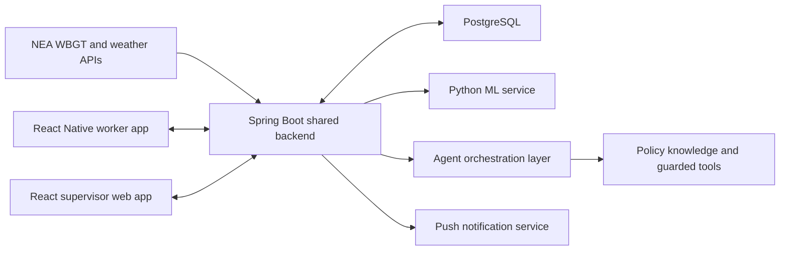

# Singapore 2026 Hackathon Problem Statements for the AD Project

**Research date:** 24 July 2026  
**Purpose:** Identify original, Singapore-specific problem statements that fit the four-week NUS-ISS AD Project.

## Executive conclusion

After a focused commercial-product review, **WBGT CrewSafe SG** remains the strongest heat-specific proposal but is no longer the highest-scoring overall concept. Its implementation has substantial overlap with existing heat-safety and field-workforce products. Its defensible gap is narrower: a MOM-specific, public-data, human-approved workflow for smaller outdoor teams that avoids wearables, CCTV and continuous location tracking.

The current overall recommendation is **FloodReady Business**, followed by **MealRescue Ops** and **VectorOps SG**. WBGT CrewSafe SG remains a good choice when the theme or team preference is heat resilience and the proposal states the market overlap candidly.

| Rank | Original concept | Domain | Score | Decision |
|---:|---|---|---:|---|
| 1 | FloodReady Business | Flood resilience / public safety | **94** | Strongest overall |
| 2 | MealRescue Ops | Food resilience / waste reduction | **92** | Strong alternative |
| 3 | VectorOps SG | Dengue prevention | **90** | Recommend with originality guardrails |
| 4 | GreenPulse Facilities | Building energy efficiency | **89** | Recommend if enterprise-oriented |
| 5 | WBGT CrewSafe SG | Workplace safety / heat resilience | **88** | Strong heat-theme candidate; commercial overlap requires narrow positioning |
| 6 | AccessAble Journey | Inclusive public transport | **87** | Viable; data integration is harder |
| 7 | PortPulse Carbon | Maritime operations / decarbonisation | **86** | Ambitious; use simulated operations |
| 8 | ScamDrill Studio | Scam resilience / cybersecurity | **84** | Viable but crowded solution space |
| 9 | CareRelay SG | Caregiver coordination | **82** | Valuable but overlaps a 2026 product |
| 10 | PathwayPulse | Student readiness / education | **80** | Feasible but too close to NAISC Track 3 |

## 1. Research frame

### 1.1 AD Project requirements used

The project instructions require an original product with:

- Agentic AI.
- A mobile application.
- A web application.
- A conventional machine-learning component.
- Data visualisation through charts or dashboards.
- One common backend integrating all components into one business process.
- At least one cloud-deployed feature.
- A working MVP, CI/CD and security testing within four weeks.

The assessment gives substantial weight to product features, feasibility and usability, code quality, design artefacts, and DevSecOps. The shortlist therefore rewards a complete demonstrable workflow more than a broad but speculative idea.

### 1.2 Confirmed 2026 challenge landscape

These are sources of real problem signals, not proposals to copy:

- [AI Singapore’s National AI Student Challenge 2026](https://naisc.aisingapore.org/) published seven local tracks: multimodal security response; multi-agent anomaly detection and predictive maintenance; proactive student support; dementia support; LLM log parsing; model-drift management; and MCP-based enterprise orchestration.
- [NUS Maritime Hackathon 2026](https://maritimestudies.nus.edu.sg/events/maritime-hackathon-2026/) focused on decarbonisation, vessel-cost optimisation and safety through AI and analytics.
- [GovTech {build} 2026](https://build.tech.gov.sg/hackathon) judged problem-solution fit, stakeholder interest and prototype quality. Its public project catalogue also shows that generic government copilots and workflow agents are already crowded.
- [Hack for Public Good 2026](https://www.hack.gov.sg/2026/) published 63 projects. Existing projects include CareKampung for family caregiving, checkQR for government-link verification, and Undercover for thermally aware pedestrian routing.
- The [Public Service STE Festival 2026 announcement](https://www.nrf.gov.sg/files/Press_Release_STEF_2026_Final_and_Cleared.pdf) states that its 2026 hackathon-style innovation challenge focuses on building a resilient and sustainable Singapore through food, water and heat resilience and waste management.

### 1.3 Scoring method

Every candidate is scored out of 100:

| Criterion | Maximum |
|---|---:|
| AD technology fit | 25 |
| Four-week feasibility | 20 |
| Cohesive web/mobile/AI integration | 20 |
| Originality and differentiation | 15 |
| Singapore relevance and measurable impact | 10 |
| Dataset/API accessibility | 10 |

Scores evaluate suitability for this assignment, not the absolute social importance of the problem.

## 2. Ranked shortlist of ten original problem statements

## 1 — WBGT CrewSafe SG

**Problem statement:** How might supervisors of small, distributed outdoor teams use Singapore’s public WBGT information to anticipate heat-risk changes, approve practical task and rest adjustments, and verify that workers received the controls without wearables or continuous location tracking?

**Evidence and users.** Singapore employers must monitor heat risk and apply measures involving acclimatisation, hydration, rest, shade and work rescheduling. Heavy outdoor work requires at least a ten-minute hourly rest when WBGT reaches 32°C, with stronger measures at higher bands. Construction sites with a contract sum of S$5 million or more, shipyards and the process industry must use on-site meters; other workplaces may refer to myENV. The target users are therefore landscaping, estate or campus maintenance, outdoor cleaning and event-setup teams. Sources: [MOM heat-stress measures](https://www.mom.gov.sg/heat-stress-measures-for-outdoor-work), [2026 parliamentary answer](https://www.mom.gov.sg/newsroom/parliament-questions-and-replies/2026/0226-written-answer-to-pq-on-heat-stress-measures), and [2026 enforcement update](https://www.mom.gov.sg/newsroom/press-replies/2026/0408-steps-taken-to-mitigate-exposure-risks-for-outdoor-workers).

**Gap and originality.** Commercial overlap is significant. [HeatShield](https://heatshieldsystem.com/heat-stress-monitoring-software/) already provides hardware-free WBGT monitoring, supervisor/worker alerts, acclimatisation and audit records; [WorkTrac](https://worktrac.io/) combines field scheduling, crew communication, break management and a heat/weather safety add-on; Singapore vendors such as [OTM](https://www.otm.sg/wbgt) provide sensor-led alerts and reports; and [viAct](https://www.viact.ai/post/heat-stress-management-singapore-construction) describes AI-led scheduling with CCTV and wearables. WBGT CrewSafe SG’s narrower difference is a MOM-specific, public-data, supervisor-approved workflow for small teams that avoids wearables, CCTV and continuous GPS. This is a localisation and integration gap, not a new category. It also differs from HFPG’s [Undercover](https://www.hack.gov.sg/2026/undercover/), which optimises shaded pedestrian routes.

**End-to-end workflow.** A supervisor creates a site and shift; workers complete a minimal readiness check; live and forecast WBGT are evaluated; the agent proposes task, hydration and rest changes; a supervisor approves material changes; workers acknowledge alerts and breaks in the mobile app; the web dashboard shows compliance and predicted-versus-observed risk.

**Technology mapping.**

- Agentic AI: monitor, plan and explain interventions using MOM rules and the ML forecast.
- ML: 30/60-minute WBGT regression and risk-band classification.
- Mobile: worker check-in, reminders, acknowledgement and incident escalation.
- Web/dashboard: site configuration, shift planner, live risk, compliance and model metrics.
- Shared backend/cloud: role-based API, PostgreSQL, weather ingestion and notifications deployed in the cloud.
- DevSecOps: automated tests, dependency/SAST scans, secrets handling and auditable agent actions.

**Data/APIs.** NEA’s [real-time WBGT API](https://data.gov.sg/datasets/d_87884af1f85d702d4f74c6af13b4853d/view) updates every 15 minutes and has observations from February 2025. NEA also provides [station-level temperature, humidity, rainfall and wind APIs](https://data.gov.sg/collections/1459/view). Site and worker records can be synthetic for the MVP.

**Feasibility.** Very good. Limit v1 to one simulated landscaping or campus-maintenance crew, predefined work zones, three task-intensity levels and rule-backed recommendations. Public readings must display station, observation time and freshness, and supervisors may enter a local reading. No wearable integration is required.

**Risks.** False assurance, missing weather data, sensitive health information and alert fatigue. Mitigate with explicit non-medical positioning, conservative fallbacks, minimal health fields, supervisor approval and a visible data-freshness indicator.

**Score:** AD fit 24/25; feasibility 18/20; cohesion 19/20; originality 8/15; Singapore impact 10/10; data 9/10 = **88/100**.

**Status:** Strong heat-theme candidate if pitched as a Singapore-specific operational workflow, not as an unprecedented heat-safety product.

## 2 — FloodReady Business

**Problem statement:** How might small businesses, childcare centres and community facilities translate fast-changing rainfall and flood alerts into site-specific, assigned and auditable protective actions before water reaches their premises?

**Evidence and users.** PUB says sudden intense rainfall can temporarily overwhelm drainage and that climate change increases the need for community preparedness. Its operational system combines more than 1,000 water-level sensors, over 500 cameras, rain gauges and radar. Official guidance asks home and business owners to maintain drains, prepare flood barriers, move essential items and isolate electricity when needed. Sources: [PUB forecasting and monitoring](https://www.pub.gov.sg/Public/KeyInitiatives/Flood-Resilience/Flood-Forecasting-and-Monitoring), [flood safety tips](https://www.pub.gov.sg/Public/KeyInitiatives/Get-Flood-Wise/Flood-Safety-Tips), and [2025 resilience campaign](https://www.pub.gov.sg/Resources/News-Room/PressReleases/2025/11/PUB-launches-second-flood-resilience-campaign-to-promote-community-preparedness).

**Gap and originality.** PUB already supplies alerts and safety advice. The product’s novelty is converting a regional signal into a premises-specific response plan, task ownership, completion evidence, contact-tree updates and after-action learning. It is not another weather app or public route planner.

**End-to-end workflow.** A manager configures a premise, assets, thresholds and response checklist; the platform monitors rainfall and flood signals; ML estimates a site risk band; an agent proposes and sequences actions; the manager approves escalation; staff receive mobile tasks and upload completion evidence; the dashboard tracks readiness and incident response.

**Technology mapping.**

- Agentic AI: event watcher, response-plan orchestrator and status summariser.
- ML: short-horizon site-risk classifier using rainfall, alerts, time and site features.
- Mobile: staff task assignment, evidence capture, safety acknowledgement and status.
- Web/dashboard: site setup, readiness audit, live incident board and response analytics.
- Shared backend/cloud: event ingestion, rules, task workflow, notifications and audit log.
- DevSecOps: resilient API fallbacks, authorization tests, audit integrity and incident simulations.

**Data/APIs.** Use NEA rainfall and forecast APIs, the operational [PUB Flood Alerts API status](https://status.data.gov.sg/), and PUB’s [water-level sensor locations](https://data.gov.sg/datasets/d_31333fa5cf0834f012d840365b336610/view). Because long historical site-level flood labels are not openly comprehensive, train and demonstrate with a clearly disclosed combination of available history and synthetic site scenarios.

**Feasibility.** Very good if the MVP covers one premise type and three alert levels. Do not attempt hydraulic simulation or evacuation-route optimisation.

**Risks.** Sparse labels, API outages, unsafe automated advice and false alarms. Mitigate with official checklists, conservative rules, manual confirmation and an offline cached response plan.

**Score:** AD fit 24/25; feasibility 18/20; cohesion 20/20; originality 13/15; Singapore impact 10/10; data 9/10 = **94/100**.

**Status:** Strong alternative.

## 3 — MealRescue Ops

**Problem statement:** How might F&B operators forecast avoidable surplus early enough to reduce overproduction and, when surplus still occurs, coordinate a safe, traceable donation or treatment decision?

**Evidence and users.** Singapore requires certain large food-waste generators to segregate food waste for treatment. Mandatory waste reporting also requires affected premises to measure, retain records and submit reduction plans. Since 1 January 2025, the Good Samaritan Food Donation Act has protected qualifying donors only when food-safety and handling conditions are met. Primary users are kitchen managers, sustainability managers, food charities/intermediaries and collection volunteers. Sources: [NEA food-waste strategies](https://www.nea.gov.sg/our-services/waste-management/3r-programmes-and-resources/food-waste-management/food-waste-management-strategies), [mandatory waste reporting](https://www.nea.gov.sg/our-services/waste-management/mandatory-waste-reporting), and [SFA food-donation guidance](https://www.sfa.gov.sg/food-safety-tips/safe-food-practices/food-donation).

**Gap and originality.** Donation platforms normally begin after surplus exists. MealRescue starts upstream: it forecasts demand, recommends production adjustments, creates a traceable surplus lot only when needed, checks handling constraints, matches a recipient and records the final outcome.

**End-to-end workflow.** A kitchen imports recent production and sales data; ML forecasts next-day demand and likely surplus; an agent proposes quantity adjustments; the manager approves; actual surplus is recorded with food type, quantity, preparation time and handling constraints; a compliance agent checks eligibility; a matching agent proposes a recipient or treatment route; pickup is acknowledged in mobile; dashboards show avoided waste, donated food and forecast accuracy.

**Technology mapping.**

- Agentic AI: forecast interpreter, food-safety checklist agent and recipient-matching agent.
- ML: per-item demand and surplus forecasting.
- Mobile: kitchen lot capture, photo/evidence, pickup acceptance and handover confirmation.
- Web/dashboard: planning, approvals, recipient administration, waste and forecast analytics.
- Shared backend/cloud: inventory events, matching, audit records and notifications.
- DevSecOps: role separation, tamper-evident timestamps, input validation and secure document storage.

**Data/APIs.** Public evidence includes Singapore’s [waste and recycling time series](https://data.gov.sg/datasets/d_daf568968ab40dc81e7b08887a83c8fa/view), [licensed food-establishment counts](https://data.gov.sg/datasets/d_a9e81ab29216b10b69e23e7957b680b9/view), and [licensed waste collectors](https://data.gov.sg/datasets?resultId=d_b4de98f706379b787ab86d1e69412910&sort=updatedAt). Transaction-level demand is not public; the MVP should use an explicitly synthetic POS dataset shaped like a canteen, café or hotel buffet.

**Feasibility.** Very good for one donor, three recipient profiles and a small catalogue of food categories. Matching can be simulated without onboarding real charities.

**Risks.** Food safety, liability, cold-chain verification, fabricated impact and lack of real POS data. Mitigate with checklist-based eligibility, human approval, clear simulation labels and no claim that the MVP certifies food safety.

**Score:** AD fit 24/25; feasibility 18/20; cohesion 20/20; originality 13/15; Singapore impact 10/10; data 7/10 = **92/100**.

**Status:** Strong alternative.

## 4 — VectorOps SG

**Problem statement:** How might estate managers prioritise preventive dengue inspections and coordinate resident follow-ups using live cluster data, weather trends and image-assisted breeding-risk reports?

**Evidence and users.** NEA reported that about 65% of breeding detected in dengue clusters in 2026 was in homes, compared with 23% in public areas. Singapore had 1,548 reported cases in the first 28 epidemiological weeks of 2026. Sources: [2026 prevention campaign](https://www.nea.gov.sg/media/news/news/index/singapore-enters-peak-dengue-season-public-urged-to-stay-vigilant-to-prevent-surge-in-cases), [current dengue cases](https://www.nea.gov.sg/dengue-zika/dengue/dengue-cases), and [prevention guidance](https://www.nea.gov.sg/dengue-zika/prevent-aedes-mosquito-breeding).

**Gap and originality.** Existing maps inform the public but do not provide an estate-level inspection queue, closed-loop task assignment and outcome learning. Avoid making a diagnostic mosquito-identification app.

**Workflow and technology.** Residents submit geotagged photos in mobile; a vision model flags possible stagnant-water containers; an agent combines reports with cluster, Aedes and weather signals; estate officers approve and assign inspections; the web dashboard maps priority, status and recurrence. Use NEA’s [dengue-cluster GeoJSON](https://data.gov.sg/datasets/d_dbfabf16158d1b0e1c420627c0819168/view), [high-Aedes areas](https://data.gov.sg/datasets?page=3&resultId=d_5d060d8b7838a15e8906fb22c50dbf51&sidebar=true&topics=environment) and weather APIs.

**Feasibility.** Good using transfer learning and a small labelled image set; map one town for the demo.

**Risks.** False positives, privacy in residential photos and duplicating NEA functions. Blur faces/units, require officer review and frame it as estate workflow support.

**Score:** 24 + 18 + 19 + 10 + 9 + 10 = **90/100**.

**Status:** Recommend only with a strong workflow and originality narrative.

## 5 — GreenPulse Facilities

**Problem statement:** How might managers of small institutional or commercial buildings detect unusual energy consumption, explain likely operational causes and coordinate approved corrective actions without requiring a full building-management system?

**Evidence and users.** BCA requires large covered building owners to submit annual energy information and publishes benchmarking data. Singapore aims to green 80% of its building stock by 2030; close to 66% had been greened by December 2025. Sources: [BCA benchmarking](https://www1.bca.gov.sg/sustainability/legislation-on-environmental-sustainability-for-buildings/existing-buildings/building-energy-benchmarking-report/) and [Green Building Masterplan](https://www1.bca.gov.sg/sustainability/sgbmp/).

**Gap and originality.** The MVP targets facilities that have meter exports but lack expensive optimisation platforms. It links anomaly detection to explainable, approved work orders rather than merely plotting consumption.

**Workflow and technology.** Upload half-hourly meter data; ML detects deviations from expected load; an agent correlates anomalies with weather, occupancy and equipment notes; a facilities manager approves an inspection or operating change; technicians update tasks by mobile; dashboards show energy-use intensity, anomalies and verified savings. Candidate sources include [EMA half-hourly system demand](https://www.ema.gov.sg/resources/statistics/half-hourly-system-demand-data) and BCA building energy performance files.

**Feasibility.** Good with synthetic building submeter data and one equipment category.

**Risks.** No real control-system integration, weak causal explanations and false savings claims. Keep actions advisory and compare against a defined baseline.

**Score:** 23 + 17 + 19 + 12 + 9 + 9 = **89/100**.

**Status:** Best enterprise-focused alternative.

## 6 — AccessAble Journey

**Problem statement:** How might wheelchair users, seniors and caregivers plan and report an end-to-end public-transport journey based on lift availability, barrier-free stops, crowding and assistance needs rather than travel time alone?

**Evidence and users.** LTA’s 2026 consultations found demand for improved connectivity, comfort and a more inclusive transport system. All trains and public buses are wheelchair-accessible, while 98% of bus stops are barrier-free; practical disruptions and end-to-end uncertainty can still affect travellers. Sources: [2026 consultation findings](https://www.lta.gov.sg/content/ltagov/en/newsroom/2026/3/news-releases/lta-shares-insights-ltmp-focus-group-discussions.html) and [inclusive transport information](https://www.lta.gov.sg/content/ltagov/en/getting_around/public_transport/a_better_public_transport_experience/an_inclusive_public_transport_system.html).

**Gap and originality.** Optimise for confidence and assistance, not just route speed. Distinguish it from Undercover, whose future roadmap already mentions accessibility, by centring verified disruptions, assistance hand-offs and caregiver visibility.

**Workflow and technology.** A user selects mobility needs; an ML ranking model scores route reliability; an agent explains trade-offs and monitors changes; the mobile app guides and accepts accessibility reports; operators moderate reports and inspect issue heatmaps on web. LTA DataMall provides bus, passenger-volume and station-crowd interfaces in its [API guide](https://datamall.lta.gov.sg/content/dam/datamall/datasets/LTA_DataMall_API_User_Guide.pdf?ref=public_apis).

**Feasibility.** Moderate. Restrict the demo to a small corridor and preloaded accessibility attributes.

**Risks.** API key/dependency, stale crowdsourced reports and safety implications. Display freshness and maintain an official-information fallback.

**Score:** 23 + 16 + 19 + 12 + 9 + 8 = **87/100**.

**Status:** Viable but integration-heavy.

## 7 — PortPulse Carbon

**Problem statement:** How might a small maritime service operator forecast harbour-service demand, consolidate vessel jobs and compare operational schedules by estimated fuel, waiting time and emissions?

**Evidence and users.** MPA’s 2026 technology roadmap prioritises autonomous port operations, smart ships and intelligent integrated port services, while the decarbonisation blueprint includes port terminals, harbour craft and carbon accounting. Sources: [2026 Maritime Technology and Research Roadmap](https://www.mpa.gov.sg/media-centre/details/singapore-maritime-technology---research-roadmap-2026-edition-to--advance-maritime-innovation-and-capabilities-development) and [decarbonisation blueprint](https://www.mpa.gov.sg/maritime-singapore/sustainability/maritime-singapore-decarbonisation-blueprint).

**Gap and originality.** Focus on a small service provider’s dispatch decisions, not port-wide traffic control or autonomous navigation.

**Workflow and technology.** Import vessel jobs; ML forecasts workload; a planning agent groups compatible jobs and proposes a schedule; a dispatcher approves; crews update job status on mobile; the web dashboard compares wait, distance, fuel proxy and emissions proxy. Use MPA’s [monthly vessel-arrival dataset](https://data.gov.sg/datasets/d_8f264219109e61fffa87ac64dd5a9a65/view) plus simulated job-level data.

**Feasibility.** Moderate; the optimisation and operational dataset must be simplified.

**Risks.** Proprietary operational data, inaccurate carbon factors and excessive domain complexity. Label estimates and avoid navigation or safety-critical decisions.

**Score:** 23 + 15 + 18 + 14 + 9 + 7 = **86/100**.

**Status:** Ambitious portfolio choice.

## 8 — ScamDrill Studio

**Problem statement:** How might SMEs and families run adaptive, consent-based scam simulations that teach users which cues they missed and measure whether recognition improves over time?

**Evidence and users.** Singapore recorded 37,308 scam cases and about S$913.1 million in losses in 2025; the median loss increased to S$1,644. CSA reported approximately 4,800 phishing attempts in 2025 and piloted a national simulated scams exercise in March 2026. Sources: [SPF 2025 brief summary](https://www.police.gov.sg/Media-Hub/Police-Life/2026/02/Scams-and-Cybercrime-Fell-by-Almost-a-Quarter-in-2025), [CSA 2026 landscape announcement](https://www.csa.gov.sg/news-events/press-releases/csa-s-initiatives-to-strengthen-singapore-s-cyber-defences-amid-an-ai-driven-threat-landscape/), and [2026 ScamShield bulletins](https://www.scamshield.gov.sg/archive/2026-scams-bulletins/).

**Gap and originality.** Teach recognition through safe simulations and feedback rather than building another message detector or government-link checker.

**Workflow and technology.** An administrator selects a safe campaign; an agent generates bounded scenarios from official patterns; participants respond in mobile; ML estimates susceptibility themes; the agent assigns micro-lessons; a dashboard measures improvement. Use official bulletins and a manually curated scenario corpus.

**Feasibility.** Good, but all sends should remain inside the app for the MVP.

**Risks.** Deception, anxiety, collection of sensitive behaviour and extensive overlap with ScamShield, HFPG checkQR and GovTech scam projects. Require opt-in, debrief immediately and prohibit real credential capture.

**Score:** 23 + 18 + 18 + 9 + 10 + 6 = **84/100**.

**Status:** Only pursue if the educational-simulation boundary is explicit.

## 9 — CareRelay SG

**Problem statement:** How might family caregivers share care tasks, detect escalating workload and find an appropriate respite option before one caregiver becomes overwhelmed?

**Evidence and users.** Singapore is projected to be super-aged in 2026, and one in four citizens will be 65 or older by 2030. AIC describes respite as temporary relief and provides a short caregiver-burden screen; it also notes that navigating services can be difficult. Sources: [MOH Age Well SG](https://www.moh.gov.sg/ageing-well/ageing-in-the-community/), [AIC respite options](https://www.aic.sg/Caregiving-Support/Take-a-Break), and [AIC caregiver stress guidance](https://aic.sg/caregiving/government-guidelines-and-tools-on-workplace-support/).

**Gap and originality.** Predict uneven workload and trigger a family planning conversation; do not diagnose burnout. However, HFPG 2026 already produced [CareKampung](https://www.hack.gov.sg/2026/), a shared family-caregiving coordination space, which materially reduces originality.

**Workflow and technology.** Family members record tasks and availability; an ML score identifies workload imbalance; an agent proposes redistribution or suitable respite information; a designated caregiver approves; mobile handles tasks and check-ins; web shows trends and care plans. MOH’s [eldercare-services geospatial dataset](https://data.gov.sg/datasets/d_3545b068e3f3506c56b2cb6b6117b884/view) can support service discovery.

**Feasibility.** Good technically, but meaningful validation with caregivers and careful privacy design are necessary.

**Risks.** Sensitive health data, family conflict, medical inference and existing-product overlap.

**Score:** 24 + 17 + 19 + 8 + 9 + 5 = **82/100**.

**Status:** Socially strong, strategically weaker.

## 10 — PathwayPulse

**Problem statement:** How might tertiary students turn attendance, assignment, wellbeing and career-event signals into a transparent weekly action plan while keeping counsellors and lecturers in control of sensitive interventions?

**Evidence and users.** NAISC 2026 Track 3 explicitly asks for a proactive student agent spanning academic success, wellbeing and career readiness. This proves relevance but also creates a serious originality risk. Source: [NAISC 2026](https://naisc.aisingapore.org/).

**Gap and originality.** A viable variant would focus narrowly on evidence-based internship readiness for a specific diploma cohort, rather than a universal student companion.

**Workflow and technology.** Students import a mock schedule and skill evidence; ML predicts task-overload or readiness gaps; an agent proposes weekly actions; students approve; staff see aggregated dashboards; mobile supports check-ins. Use synthetic institutional data and public job-skill descriptions.

**Feasibility.** High, but the concept is crowded and access to genuine institutional data is unlikely in four weeks.

**Risks.** Student surveillance, wellbeing inference, bias and direct similarity to the published challenge.

**Score:** 23 + 18 + 19 + 7 + 8 + 5 = **80/100**.

**Status:** Do not choose unless the instructor theme is education.

## 3. Proposal-ready concept A: WBGT CrewSafe SG

### 3.1 Product vision

**Vision:** Give every outdoor-work supervisor an explainable, auditable copilot that converts changing heat conditions into timely, worker-centred action.

**Value proposition:** WBGT CrewSafe SG closes the gap between seeing a WBGT value and proving that an appropriate, approved intervention reached the right workers in a small, distributed outdoor crew.

### 3.2 Problem scenario

A landscaping or campus-maintenance team begins a morning shift with mixed task intensity and several newly assigned workers. WBGT rises faster than expected. The supervisor currently checks myENV, manually interprets requirements, changes the work plan and communicates by word of mouth or chat. Records are fragmented, acknowledgements are unavailable, and the safety manager cannot distinguish a missed action from a missing record.

WBGT CrewSafe SG predicts the next risk band, evaluates deterministic MOM rules, drafts a work/rest or task adjustment, asks the supervisor to approve it, sends worker-specific instructions and records acknowledgements and completion.

### 3.3 Users, objectives and outcomes

**Primary users**

- Outdoor worker.
- Site supervisor.
- Workplace safety manager/system administrator.

**Objectives**

- Surface current and forecast heat risk with data freshness.
- Generate explainable interventions grounded in MOM measures.
- Require human approval for schedule or deployment changes.
- Record alerts, acknowledgements, rest and hydration events.
- Give management useful compliance and model-performance dashboards.

**MVP outcome measures**

- At least 95% of simulated mandatory interventions generated for the correct risk band.
- Median alert delivery under 60 seconds after a new reading is processed.
- At least 90% acknowledgement capture in the scripted UAT scenario.
- WBGT forecast reported with MAE and risk-band macro F1.
- Every agent recommendation traceable to inputs, rule and approver.

These are prototype quality targets, not claims of reducing real injuries.

### 3.4 High-level use cases

| Actor | Use cases |
|---|---|
| Worker | View shift risk; complete readiness check; receive and acknowledge instructions; record rest/hydration; report symptoms or unsafe conditions |
| Supervisor | Configure shift/tasks; view live risk; review and approve agent plan; reassign work; monitor acknowledgements; escalate incident |
| Safety manager | Configure policy; manage roles/sites; view compliance and forecast dashboards; export audit report |
| External services | Supply weather/WBGT; deliver push notification |

### 3.5 MVP, stretch scope and exclusions

**MVP**

- One site with seeded worker and shift data.
- Two roles plus administrator.
- Three task-intensity levels and acclimatisation flag.
- Live NEA WBGT ingestion with cached fallback.
- 30/60-minute forecast.
- Rule-grounded intervention plan with supervisor approval.
- Worker notifications, acknowledgements and event capture.
- Compliance and ML dashboards.

**Stretch**

- Multilingual instruction templates.
- QR/NFC check-in at rest areas.
- Multi-site comparison.
- Wearable or on-site meter adapter using simulated messages.

**Explicit exclusions**

- Medical diagnosis or fitness certification.
- Automatic emergency-service contact.
- Continuous GPS tracking.
- Replacing legally required on-site meters or safety officers.
- Fully autonomous worker redeployment.

### 3.6 Prioritised backlog and sprint allocation

| Priority | User story | Sprint |
|---:|---|---|
| 1 | As a supervisor, I can create a shift with workers, tasks and intensity so risk is contextualised. | 1 |
| 2 | As the system, I ingest current WBGT and show timestamp/freshness. | 1 |
| 3 | As a worker, I can sign in and complete a readiness check. | 1 |
| 4 | As the system, I predict 30/60-minute WBGT and risk band. | 2 |
| 5 | As a supervisor, I receive an explainable proposed intervention and can approve or edit it. | 2 |
| 6 | As a worker, I receive and acknowledge an approved instruction. | 2 |
| 7 | As a worker, I can record rest/hydration and escalate a concern. | 2 |
| 8 | As a safety manager, I can view compliance, response time and forecast accuracy. | 3 |
| 9 | As an auditor, I can export an immutable action timeline. | 3 |
| 10 | As a user, I receive clear fallback behaviour when weather data is stale. | 3 |

**Sprint 0:** Validate problem framing; create use-case diagram, backlog and worker/supervisor mockups.  
**Sprint 1:** Establish architecture, authentication, site/shift model, API ingestion and evolutionary prototypes for web, mobile and ML.  
**Sprint 2:** Complete forecast, agent approval flow, notifications and main business workflow; establish CI/CD and security scans.  
**Sprint 3:** Complete dashboards, audit export, failure handling, UAT, automated tests, performance evidence and demo recording.

### 3.7 Architecture and technology

**Practical stack**

- Web: React with TypeScript, Material UI and Chart.js.
- Mobile: React Native with Expo.
- Common backend: Java Spring Boot REST API with WebSocket or server-sent status updates.
- ML: Python FastAPI service using pandas and scikit-learn/XGBoost.
- Agent: tool-calling LLM constrained to fetch risk, retrieve applicable rules, draft a plan and submit it for approval; it cannot directly alter assignments.
- Data: PostgreSQL; optional object storage for reports.
- Cloud: deploy backend, database and ML service to Azure, AWS or another advisor-approved platform; deploy web as a static cloud app.

### 3.8 Agent design and human control

1. **Monitor agent** reads fresh weather, shift and acknowledgement state.
2. **Planning agent** invokes deterministic policy functions and the ML forecast, then drafts a prioritised plan with reasons.
3. **Communication agent** converts an approved plan into concise worker instructions and tracks acknowledgement.

Human approval is mandatory for task reassignment, work suspension, redeployment and incident escalation. Only reminders for already approved actions may be sent automatically.

### 3.9 ML specification

**Task:** Predict site WBGT 30 and 60 minutes ahead and classify the future MOM-relevant risk band.

**Features:** Recent WBGT lags and rolling changes; temperature; humidity; wind speed; rainfall; hour; month; optional site reading.

**Baseline:** Persistence forecast and linear regression.

**Candidate model:** Gradient-boosted regression, with band classification derived from the predicted value. A direct classifier may be compared if time permits.

**Preparation:** Align station timestamps, handle gaps conservatively, create lag features, and use chronological rather than random train/test splits.

**Metrics:** MAE/RMSE for WBGT, macro F1 and recall for higher-risk bands, plus confusion matrix. The dashboard must show predicted versus actual values and data gaps.

### 3.10 User journeys

**Worker mobile:** Sign in → view shift and current risk → answer minimal readiness questions → receive approved instruction → acknowledge → log rest/hydration → raise concern if needed.

**Supervisor web:** Open live site board → review forecast and affected tasks → inspect policy explanation → approve/edit plan → monitor acknowledgements → close event and review timeline.

Both clients use the same identity, shift, policy, recommendation and audit records through the common backend.

### 3.11 DevSecOps and quality

- GitHub Actions pipeline: build, unit tests, API integration tests, mobile/web lint, dependency scan, SAST, container scan and cloud deployment.
- Security: RBAC, short-lived tokens, TLS, encrypted secrets, server-side authorization, minimal health data, consent notice, retention rule and audit log.
- Test cases: risk-band boundaries; stale/missing API; duplicate weather event; unauthorized site access; rejected agent plan; notification retry; late acknowledgement; model-service outage; malicious text input.
- Demonstrate OWASP-aligned validation and remediation of findings, not only a scanner screenshot.

### 3.12 Demo storyline and technical highlights

1. Begin at moderate risk with a mixed shift and one unacclimatised worker.
2. Inject or receive a rising WBGT reading; show the 60-minute high-risk forecast.
3. The agent cites the relevant rule and proposes moving heavy work, scheduling the required break and reminding hydration.
4. The supervisor approves; workers receive and acknowledge actions.
5. Show the compliance timeline, response-time chart and forecast-versus-actual graph.
6. Demonstrate an API outage and conservative cached fallback.

**Highlights:** time-series ML with honest metrics; guarded agent plus deterministic safety rules; real-time cross-platform event workflow with a complete audit trail.

### 3.13 Originality guardrail

Do not pitch “an AI heat alert app.” Pitch a **human-approved safety operations and evidence platform**. It is distinct from NAISC’s generic critical-infrastructure anomaly track and from Undercover’s shaded pedestrian navigation. Before proposal submission, search any newly released instructor examples and retain the unique combination of shift context, policy grounding, forecast, acknowledgements and audit.

## 4. Proposal-ready concept B: FloodReady Business

### 4.1 Product vision

**Vision:** Turn every relevant flood signal into the right action, owner and evidence for a specific premise.

**Value proposition:** Public alerts describe what is happening outside; FloodReady Business tells a site team what its approved plan requires now and whether those actions were completed.

### 4.2 Problem scenario and users

A childcare centre, clinic or ground-floor retailer receives heavy-rain information. Staff must decide whether to deploy barriers, move assets, protect electrical equipment, notify stakeholders or pause operations. The response plan may exist only as a document, responsibilities may be unclear, and managers cannot see completion when off-site.

**Actors:** premise manager, response lead, staff member, administrator, weather/flood service.

**Objectives and prototype measures**

- Generate the correct checklist for all scripted alert levels and premise type.
- Deliver approved tasks within 60 seconds of escalation.
- Show completion evidence and unresolved critical actions.
- Evaluate the risk classifier with macro F1 and high-risk recall.
- Preserve a complete incident and after-action timeline.

### 4.3 Use cases and scope

**Use cases:** configure premise/assets/contacts; conduct readiness audit; ingest signals; score risk; draft action plan; approve escalation; assign/complete tasks; capture photo evidence; notify internal contacts; close incident; review after-action report.

**MVP:** one premise type, one site, three alert levels, live rainfall/forecast, official flood alert when available, synthetic site sensor/readiness data, manager approval, mobile task evidence and dashboard.

**Stretch:** multiple branches, IoT water sensor simulator, multilingual tasks and comparison across incidents.

**Exclusions:** hydraulic modelling, guaranteed flood prediction, public evacuation routing, emergency-service dispatch and automatic public communications.

### 4.4 Backlog

| Priority | User story | Sprint |
|---:|---|---|
| 1 | As a manager, I configure critical assets, contacts and an official-source checklist. | 1 |
| 2 | As staff, I complete a readiness audit in mobile. | 1 |
| 3 | As the system, I ingest rainfall/forecast and display freshness. | 1 |
| 4 | As the system, I calculate and explain a site-risk band. | 2 |
| 5 | As a manager, I approve an agent-generated action sequence. | 2 |
| 6 | As staff, I receive tasks and submit timestamped evidence. | 2 |
| 7 | As a manager, I see critical gaps and acknowledgement status live. | 2 |
| 8 | As an administrator, I can replay a simulated alert for UAT. | 3 |
| 9 | As a manager, I review incident duration, task performance and readiness trends. | 3 |
| 10 | As a user, I can access a cached plan when external APIs fail. | 3 |

Sprint activities follow the same Sprint 0–3 pattern as WBGT CrewSafe SG: prototype and model in Sprint 1; complete incident workflow in Sprint 2; dashboards, UAT, security and demo in Sprint 3.

### 4.5 Architecture, agents and ML

Use the same practical React/React Native/Spring Boot/Python/PostgreSQL architecture. Replace the heat-policy tools with:

- **Watcher agent:** monitors rainfall, forecast, official alert and data freshness.
- **Response orchestrator:** retrieves the approved premise checklist and proposes ordered tasks.
- **Status agent:** summarises incomplete actions and drafts an internal update.

Managers approve any operational escalation, closure, evacuation-related step or external message.

**ML task:** classify site risk in the next 30–60 minutes.

**Features:** rainfall intensity and rolling accumulation, forecast category, flood alert, nearest sensor/known-risk proximity, time, premise floor level, barrier readiness and simulated local water reading.

**Baseline/model:** rule-only baseline versus logistic regression and gradient boosting. Use time-aware validation where historical records exist and scenario-stratified validation for synthetic site data.

**Metrics:** macro F1, high-risk recall, Brier score/calibration and false-alert rate. Clearly separate official alert from model inference.

### 4.6 Journeys, DevSecOps and demo

**Staff mobile:** see readiness status → receive approved tasks → follow safety text → upload evidence → mark blocked/complete.

**Manager web:** view map and site status → inspect alert and risk explanation → approve plan → monitor actions → close incident → view after-action report.

**Security/quality:** RBAC, signed evidence metadata, safe file upload, contact-data minimisation, immutable incident events, API timeouts/retry, cached official checklists and explicit inference labels.

**Demo:** Start with an incomplete readiness audit; inject heavy rainfall and a flood alert; show risk escalation; let the agent prioritise barriers, assets and electrical checks; approve tasks; complete them from mobile; show unresolved-action warnings and the after-action dashboard; finally demonstrate loss of the weather API.

**Technical highlights:** multi-source real-time ingestion; calibrated risk model with official/inferred separation; durable incident workflow that survives external-data failure.

### 4.7 Originality guardrail

Do not compete with PUB’s alerting or Google Maps integration. The product begins where a public alert ends: premise-specific planning, ownership, evidence and organisational learning. Use official safety language verbatim only where necessary and cite it; the agent must never invent emergency instructions.

## 5. Proposal-ready concept C: MealRescue Ops

### 5.1 Product vision

**Vision:** Prevent surplus first, then make every unavoidable surplus decision safe, fast and traceable.

**Value proposition:** Combine demand forecasting, production approval, food-safety checks, recipient matching and waste reporting in one operational flow.

### 5.2 Problem scenario and users

A canteen or hotel buffet estimates tomorrow’s production manually. When demand is lower than expected, staff discover surplus late. Donation may be possible, but teams need to capture preparation time, storage conditions, handling instructions and collection deadline while finding a suitable recipient. Otherwise the food becomes waste and reporting remains manual.

**Actors:** kitchen manager, kitchen staff, charity/intermediary coordinator, pickup volunteer and sustainability administrator.

**Objectives and prototype measures**

- Beat a simple moving-average demand baseline on MAE or WAPE.
- Create a compliant mock surplus lot in under two minutes.
- Ensure every matched lot passes all configured eligibility checks.
- Record approval, custody and outcome for every lot.
- Quantify forecast error, avoided production, donated quantity and treated/disposed quantity without double counting.

### 5.3 Use cases and scope

**Use cases:** import production/sales; forecast demand/surplus; approve production; record actuals; create surplus lot; validate handling/expiry; propose recipients; accept pickup; confirm handover; record treatment/disposal; view reports.

**MVP:** one donor, 10–20 menu items, eight to twelve synthetic historical weeks, three recipient profiles, a limited food-safety rule catalogue, manual temperature declaration, one pickup workflow and dashboards.

**Stretch:** barcode/label printing, route batching, IoT-temperature simulator, multiple donors and donation-impact certificates.

**Exclusions:** certifying food safety, commercial sale, payment, real charity onboarding, autonomous donation approval and live logistics optimisation.

### 5.4 Backlog

| Priority | User story | Sprint |
|---:|---|---|
| 1 | As a kitchen manager, I import or seed daily production and sales records. | 1 |
| 2 | As a kitchen manager, I view next-day demand and surplus forecasts. | 1 |
| 3 | As a manager, I approve or edit recommended production quantities. | 2 |
| 4 | As kitchen staff, I create a surplus lot with handling details in mobile. | 2 |
| 5 | As the system, I block incomplete/ineligible lots and explain the rule. | 2 |
| 6 | As a coordinator, I review ranked recipient matches. | 2 |
| 7 | As a volunteer, I accept pickup and confirm custody/handover. | 2 |
| 8 | As a sustainability manager, I view forecast, waste and outcome dashboards. | 3 |
| 9 | As an auditor, I export a lot-level traceability report. | 3 |
| 10 | As a user, I can record treatment/disposal when no safe match exists. | 3 |

### 5.5 Architecture, agents and ML

Use React for planning/admin web, React Native for kitchen/pickup mobile, Spring Boot for the common workflow API, PostgreSQL for item/lot/custody records, and a Python forecasting service.

- **Planning agent:** explains forecast drivers and drafts production adjustments.
- **Compliance agent:** calls deterministic eligibility and deadline functions based on captured facts; it cannot certify safety.
- **Matching agent:** ranks recipients by accepted food type, quantity, capacity, deadline and simulated travel time.

Human approval is required for production changes, lot release, recipient selection and exception handling.

**ML task:** forecast item-level next-day demand and expected surplus.

**Features:** item, day of week, recent sales lags, rolling mean, production, holidays/events, weather and promotion flag.

**Baseline/model:** seasonal naive and moving average versus gradient-boosted regression or random forest. Do not use an LLM for numerical forecasting.

**Preparation:** build a reproducible synthetic generator with demand seasonality, weather effects, promotions and noise; hold out the final two weeks.

**Metrics:** MAE/WAPE by item, overproduction quantity, underproduction quantity and forecast bias. Show the baseline comparison.

### 5.6 Journeys, DevSecOps and demo

**Kitchen mobile:** select forecasted item → record actual surplus and photo → enter preparation/storage/deadline → see eligibility result → submit for approval.

**Manager/coordinator web:** review forecasts → approve quantities → inspect eligible lots and recipient match reasons → approve handover → view outcome dashboard.

**Volunteer mobile:** see accepted simulated pickup → acknowledge handling instructions → confirm collection and handover.

**Security/quality:** tenant/role separation, server-side lot-state validation, append-only custody events, safe photo upload, expiry jobs, duplicate handover prevention and audit export. Tests must cover expired lots, incompatible recipient, missing handling instruction, conflicting pickup, model outage and manipulated client state.

**Demo:** Show tomorrow’s forecast and a preventable overproduction recommendation; approve a smaller batch; later record unavoidable surplus; let the compliance agent reject an incomplete lot; correct the missing field; show recipient ranking; complete pickup on mobile; finish with the forecast and waste dashboard.

**Technical highlights:** conventional forecasting benchmarked honestly; agentic orchestration constrained by deterministic safety rules; multi-party custody state machine across web and mobile.

### 5.7 Originality guardrail

Do not pitch a generic food-donation marketplace. The distinctive product is the **prevent–decide–trace** loop: forecast production, apply a human-approved adjustment, validate an unavoidable surplus lot, match it and account for the outcome.

## 6. Comparative recommendation

| Decision factor | WBGT CrewSafe SG | FloodReady Business | MealRescue Ops |
|---|---|---|---|
| Real-time official data | Excellent | Good, with some history limitations | Limited |
| Conventional ML clarity | Excellent | Good | Excellent |
| Agent necessity | High | High | High |
| Mobile field workflow | Excellent | Excellent | Excellent |
| Safety/regulatory complexity | High but bounded | High but bounded | High |
| Four-week demonstrability | Excellent | Very good | Very good |
| Existing-product overlap | Medium-high; narrow localisation required | Low | Low if not a marketplace |
| Best demo moment | Forecast → approved heat plan → worker acknowledgements | Alert → assigned response → evidence | Forecast → safe match → custody completion |

**Final recommendation: choose FloodReady Business on the present scores. Choose WBGT CrewSafe SG when heat resilience is the desired domain and the team accepts a localisation-and-workflow originality argument rather than claiming a new product category.**

WBGT CrewSafe SG still has an unusually clean evidence-to-feature chain:

1. Singapore has explicit WBGT-dependent workplace requirements.
2. A current official WBGT feed is available at useful frequency.
3. Forecasting future WBGT is a legitimate conventional ML task with measurable accuracy.
4. Agentic AI has a bounded role: assemble context, invoke policy tools, explain and propose.
5. Mobile and web serve genuinely different actors in one workflow.
6. The product demonstrates safety, auditability, failure handling and human oversight—strong material for usability, software-quality and DevSecOps assessment.

Choose **FloodReady Business** if the announced theme is water, climate adaptation, business continuity or community resilience. Choose **MealRescue Ops** if the theme is food security, sustainability, circular economy or waste.

## 7. Theme re-ranking guide

| Announced instructor theme | First choice | Second choice | Third choice |
|---|---|---|---|
| Heat / workplace safety / climate adaptation | WBGT CrewSafe SG | FloodReady Business | GreenPulse Facilities |
| Water / disaster readiness / resilience | FloodReady Business | WBGT CrewSafe SG | VectorOps SG |
| Food / zero waste / circular economy | MealRescue Ops | GreenPulse Facilities | VectorOps SG |
| Healthcare / ageing / community care | CareRelay SG, subject to originality redesign | AccessAble Journey | WBGT CrewSafe SG |
| Transport / smart city | AccessAble Journey | PortPulse Carbon | WBGT CrewSafe SG |
| Enterprise operations / Industry 4.0 | GreenPulse Facilities | PortPulse Carbon | WBGT CrewSafe SG |
| Cybersecurity / trust | ScamDrill Studio | WBGT CrewSafe SG | GreenPulse Facilities |
| Education / student success | PathwayPulse, narrowed to internship readiness | ScamDrill Studio | GreenPulse Facilities |

## 8. Assumptions and validation limits

- The instructor’s common theme was not available in the synced project files on 24 July 2026.
- Rankings assume a team capable of React or equivalent web/mobile development, a Java or .NET backend, and Python ML.
- Public APIs can change, rate-limit or suffer outages. The project should cache demo fixtures and show when data is stale.
- Where transaction, worksite or incident-level data is unavailable, synthetic data must be labelled as synthetic in the UI, slides and report.
- “Agentic AI” means an agent can inspect state, call bounded tools and propose or perform permitted workflow steps. A chatbot alone is insufficient.
- High-impact actions remain human-approved. None of the proposed MVPs should claim medical, food-safety, flood-safety or legal certification.
- Final originality should be rechecked after the instructor announces the theme and before proposal submission.

## 9. Principal sources

- [AD Project Instructions](sources/AD%20Project%20Instructions_updated.pdf)
- [AI Singapore National AI Student Challenge 2026](https://naisc.aisingapore.org/)
- [NUS Maritime Hackathon 2026](https://maritimestudies.nus.edu.sg/events/maritime-hackathon-2026/)
- [GovTech {build} Hackathon 2026](https://build.tech.gov.sg/hackathon)
- [Hack for Public Good 2026 projects](https://www.hack.gov.sg/2026/)
- [Public Service STE Festival 2026 announcement](https://www.nrf.gov.sg/files/Press_Release_STEF_2026_Final_and_Cleared.pdf)
- [Data.gov.sg API overview](https://guide.data.gov.sg/developer-guide/api-overview)
- Domain-specific government sources are linked beside the claims they support throughout the report.
