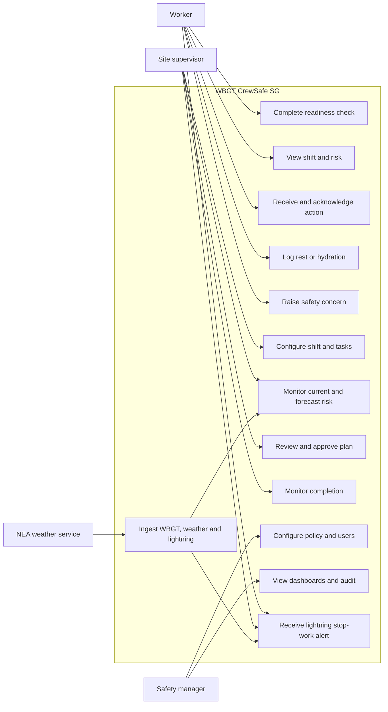
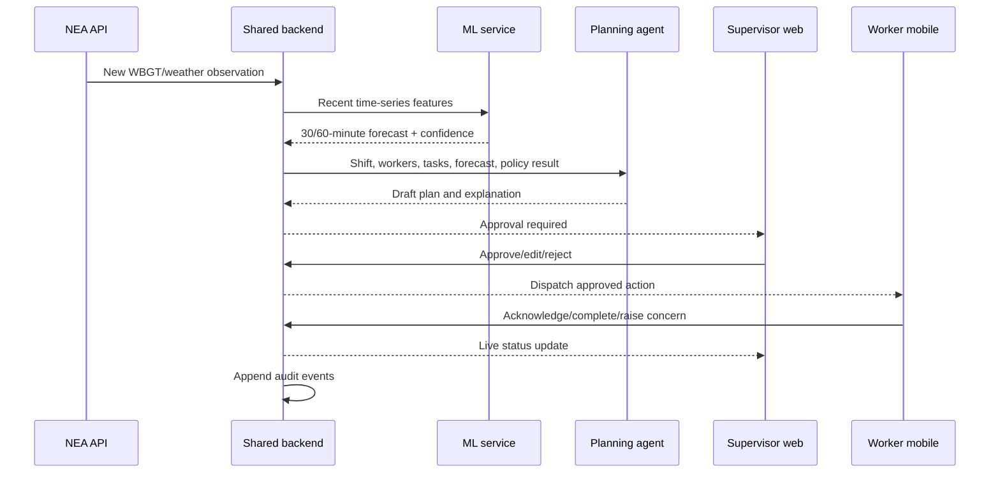
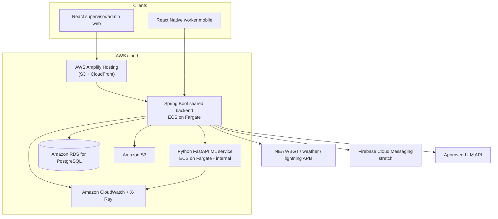
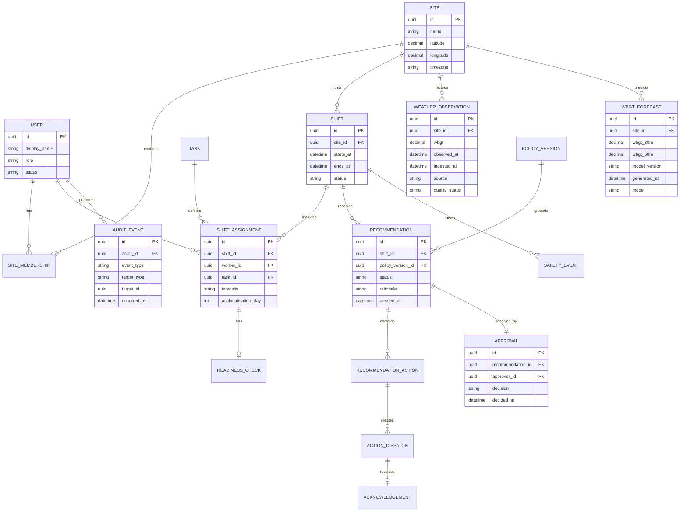

# WBGT CrewSafe SG — AD Project Plan Report

**Document status:** Implementation-ready project plan  
**Prepared:** 24 July 2026  
**Delivery model:** Sprint 0 plus three one-week delivery sprints  
**Recommended product type:** Evolutionary prototype that becomes the final MVP

---

## 1. Executive summary

WBGT CrewSafe SG is a human-supervised heat-safety operations platform for smaller outdoor teams that may refer to myENV rather than being required to operate an on-site WBGT meter. The initial target is landscaping, estate or campus maintenance, outdoor cleaning and event-setup teams—not construction sites with a contract sum of S$5 million or more, shipyards, or the process industry. It combines live public Wet Bulb Globe Temperature (WBGT) readings, short-horizon machine-learning forecasts, task intensity and worker acclimatisation context to recommend timely hydration, rest and task adjustments. It also surfaces NEA lightning-strike observations as an overriding stop-work hazard displayed above the WBGT reading, because an approaching thunderstorm—not heat—can be the more immediate danger to an outdoor crew. Supervisors approve material changes before the system sends instructions to workers. Every recommendation, approval, dispatch and acknowledgement is recorded for safety review.

The product addresses an operational gap: seeing a WBGT reading is not the same as deciding what to do, communicating the decision and proving that the relevant workers received it.

WBGT CrewSafe SG is suitable for the AD Project because it forms one cohesive workflow across all required technologies:

- **Mobile application:** worker readiness checks, instructions, acknowledgements, rest/hydration logs and safety concerns.
- **Web application:** site and shift planning, approval workflow, live operations board, compliance dashboard and audit export.
- **Machine learning:** 30- and 60-minute WBGT forecasting with measurable accuracy.
- **Agentic AI:** gathers operational context, invokes deterministic safety-policy tools, proposes a plan and tracks approved actions.
- **Common backend:** identity, sites, shifts, policy decisions, events, approvals and dashboards.
- **Cloud deployment:** web, backend, ML service and database.
- **Data visualisation:** current/forecast WBGT, risk bands, acknowledgement status, intervention compliance and model performance.
- **DevSecOps:** CI/CD, automated tests, dependency and source scanning, container scanning and security remediation evidence.

**Recommendation:** Build a narrow, credible MVP for one simulated landscaping or campus-maintenance crew. Do not add wearables, continuous location tracking or medical assessment during the four-week project. Do not present the product as a substitute for an on-site meter at workplaces where MOM requires one.

---

## 2. Business context and evidence

Singapore’s Ministry of Manpower requires employers and occupiers to manage heat risk for outdoor work. Required measures vary with WBGT and include acclimatisation, WBGT monitoring, hydration, rest, shade, work rescheduling, emergency response and closer monitoring of vulnerable workers. For heavy outdoor work, at least ten minutes of hourly rest is required when WBGT reaches 32°C, rising to at least fifteen minutes at 33°C and above. Newly assigned workers and workers returning after more than one week away must be acclimatised over at least seven days. Source: [MOM Heat Stress Measures for Outdoor Work](https://www.mom.gov.sg/heat-stress-measures-for-outdoor-work).

MOM reported 24 non-fatal work-related heat illnesses between 2021 and 2025, of which 22 related to outdoor work. By April 2026, enforcement action had been taken against 213 non-compliant employers. Sources: [MOM February 2026 parliamentary answer](https://www.mom.gov.sg/newsroom/parliament-questions-and-replies/2026/0226-written-answer-to-pq-on-heat-stress-measures) and [MOM April 2026 enforcement update](https://www.mom.gov.sg/newsroom/press-replies/2026/0408-steps-taken-to-mitigate-exposure-risks-for-outdoor-workers).

NEA publishes real-time WBGT observations every 15 minutes. The dataset begins in February 2025 and is suitable for a time-series forecasting prototype. NEA also publishes temperature, relative humidity, rainfall and wind observations at weather-station level. Sources: [NEA WBGT observations](https://data.gov.sg/datasets/d_87884af1f85d702d4f74c6af13b4853d/view) and [NEA real-time weather collection](https://data.gov.sg/collections/1459/view).

NEA additionally publishes near-real-time lightning-strike observations—cloud-to-ground and cloud-to-cloud strikes detected by a five-sensor network, refreshed at roughly two-minute intervals with a short transmission delay and 200 m–2 km location accuracy. Lightning is treated as a distinct, higher-priority hazard than heat: an approaching thunderstorm warrants immediate cessation of outdoor work and sheltering, so WBGT CrewSafe SG shows a lightning risk state (clear, advisory or stop-work) *above* the WBGT reading and lets it override heat-based recommendations. WBGT CrewSafe SG is not a lightning-safety authority; it surfaces the public observation and the corresponding stop-work guidance, and the supervisor remains responsible for the decision to suspend and resume work. Source: [NEA Lightning Observation](https://data.gov.sg/datasets/d_08238953fe0f6dd13f10714ebfbcb9f9/view).

MOM explicitly permits workplaces outside the three mandatory on-site-meter categories to refer to the NEA myENV app. This creates a credible low-cost target segment, but public WBGT represents the reporting station rather than every crew’s exact microclimate. WBGT CrewSafe SG must therefore show the station, observation time and freshness, allow a supervisor to enter a local reading, and avoid claiming site-measurement equivalence.

### 2.1 Current-state problem

A site supervisor may currently:

1. Check an on-site meter or public WBGT reading.
2. Interpret the applicable safety measures.
3. Review worker and task circumstances.
4. Alter work or rest arrangements.
5. Communicate instructions verbally or through chat.
6. Manually reconstruct what happened for later reporting.

This process can produce delayed decisions, inconsistent explanations, incomplete acknowledgement records and fragmented evidence.

### 2.2 Proposed future state

WBGT CrewSafe SG will:

1. Ingest current environmental data and show its freshness.
2. Forecast the next 30 and 60 minutes.
3. Evaluate deterministic policy rules against shift and worker context.
4. Let the agent draft a prioritised intervention plan with reasons.
5. Require supervisor approval for material actions.
6. Dispatch approved instructions to affected workers.
7. Capture acknowledgements, completion and safety concerns.
8. Present an auditable timeline and management dashboard.

The product assists safety management; it does not replace legal duties, professional judgement or emergency procedures. It is not intended for the construction, shipyard or process-industry sites for which MOM requires an on-site WBGT meter.

### 2.3 Existing commercial products and originality assessment

The current implementation is **commercially available in substantial parts**. WBGT CrewSafe SG should not be described as the first heat-monitoring, alerting, scheduling or compliance-record product.

| Product | Publicly advertised overlap | Important difference from WBGT CrewSafe SG |
|---|---|---|
| [myENV](https://www.tech.gov.sg/products-and-services/for-citizens/environment/myenv/) | Singapore environmental and heat-stress information | Provides awareness rather than a crew-specific approval, dispatch, acknowledgement and audit workflow |
| [Absolute WBGT](https://absolute-instrument.com/products/heat-stress-monitors-absolute-wbgt-heat-stress-monitoring-system) and [OTM WBGT Monitoring App](https://www.otm.sg/wbgt) | Singapore WBGT hardware, live readings, alerts, logs and reports | Primarily sensor-led monitoring for fixed or higher-risk sites; not a lightweight public-data workflow for small mobile crews |
| [HeatShield](https://heatshieldsystem.com/heat-stress-monitoring-software/) | Hardware-free outdoor WBGT, supervisor alerts, worker SMS, acclimatisation tracking, acknowledgement status and compliance exports; plans aimed at small crews | Very close functional benchmark, but configured for US state/OSHA frameworks rather than MOM’s WBGT bands and myENV/NEA data |
| [HeatShield PRO for landscaping](https://getheatshield.pro/landscaping) | Mobile crews, route-based heat tracking, check-ins, acclimatisation, manager alerts and documentation | US/OSHA positioning; no evidence on the public page of Singapore policy rules, NEA integration or supervisor-approved task replanning |
| [WorkTrac](https://worktrac.io/) | Field tasks, shift scheduling, break management, crew messaging, read tracking, audit trail and a heat/weather safety add-on | A broad US field-workforce platform using heat-index/OSHA controls, rather than a focused MOM/WBGT decision and evidence product |
| [HeatGuard](https://heatguard.ae/features/) | Worker app, hydration nudges, AI risk flags, dashboards, SOS, break compliance and audit export | GCC-focused and oriented toward worker vitals, location and tele-triage, which WBGT CrewSafe SG deliberately excludes |
| [viAct](https://www.viact.ai/post/heat-stress-management-singapore-construction) | Singapore pilot combining environmental inputs, dynamic work-rest scheduling, task rescheduling and audit records | Targets construction and uses CCTV plus wearables; outside WBGT CrewSafe SG’s small-team, hardware-optional, privacy-preserving scope |
| [Starkz AI](https://starkzai.com/) | AI agents generate break timing, task rotation and multilingual messages for landscaping, maintenance and event teams | Emerging direct concept overlap; its public page starts from a worksite photo, while WBGT CrewSafe SG starts from authoritative Singapore rules, live observations and an approved operational plan |

**Market verdict.** No public product page reviewed on 24 July 2026 demonstrated the exact combination of (1) MOM-specific deterministic rules, (2) NEA/myENV-compatible public WBGT for non-mandatory sites, (3) short-horizon Singapore WBGT forecasting, (4) task-level alternatives generated within operational constraints, (5) supervisor approval, (6) worker acknowledgement and unresolved-action escalation, and (7) no biometric, CCTV or continuous-location monitoring. This is a narrow integration and localisation gap, not a new product category. The review is based on public product information and is not an exhaustive procurement survey.

**Working-name note.** The exact “WBGT CrewSafe SG” phrase did not surface in the preliminary public search conducted on 24 July 2026. The name should nevertheless be treated as a student-project working title rather than as trademark clearance.

**Defensible originality angle.**

- Target underserved small, distributed outdoor crews rather than sensor-heavy industrial sites.
- Use deterministic MOM rules for required controls; use AI only to generate feasible operational alternatives and communications.
- Treat the core outcome as a closed evidence loop: **observe → decide → approve → dispatch → acknowledge → escalate → audit**.
- Remain useful without wearables, CCTV or continuous GPS.
- Compare forecast-assisted planning with a no-forecast baseline and measure operational response quality rather than claiming injury prevention.

Because close international and emerging competitors exist, the originality score should be treated as **8/15**, with the full AD-project fit recalibrated to **88/100**.

---

## 3. Product vision and proposal

### 3.1 Product vision

> Give every outdoor-work supervisor an explainable, auditable copilot that converts changing heat conditions into timely, worker-centred action.

### 3.2 Value proposition

WBGT CrewSafe SG closes the operational loop between:

**weather signal → forecast → policy evaluation → human decision → worker action → evidence**

### 3.3 Problem statement

> How might supervisors of small, distributed outdoor teams use Singapore’s public WBGT information to anticipate heat-risk changes, approve practical task and rest adjustments, and verify that workers received the controls—without purchasing wearables or continuously tracking their location?

### 3.4 Target users

| User | Need | Primary interface |
|---|---|---|
| Outdoor worker | Clear, timely instructions and a quick way to acknowledge, record recovery actions or raise a concern | Mobile |
| Crew supervisor | One live view of conditions, forecast, affected tasks, recommendations and worker acknowledgements | Web |
| Workplace safety manager | Policy configuration, oversight, trends, audit evidence and model-performance visibility | Web |
| System administrator | User, role, site and integration management | Web |

### 3.5 Business objectives

| ID | Objective |
|---|---|
| BO-01 | Reduce the time between a material heat-risk change and an approved worker instruction |
| BO-02 | Apply the configured heat policy consistently and explain which rule produced each action |
| BO-03 | Give supervisors visibility of unacknowledged or incomplete safety actions |
| BO-04 | Produce a reliable audit trail without continuous worker-location surveillance |
| BO-05 | Demonstrate the value and limitations of near-term WBGT forecasting |

### 3.6 MVP success measures

| Measure | Target |
|---|---:|
| Correct mandatory action in scripted policy scenarios | ≥95% |
| Median dispatch time after an approved recommendation | <60 seconds |
| Worker acknowledgement captured during UAT | ≥90% |
| Recommendations with complete input/rule/approver trace | 100% |
| High-risk-band recall on held-out ML data | ≥85%, or baseline comparison and limitation documented |
| Critical UAT scenarios passed | 100% |
| Unresolved high-severity security findings at submission | 0 |

Targets measure prototype quality. The project will not claim a measured reduction in workplace injuries.

---

## 4. Scope

### 4.1 MVP scope

- One simulated landscaping or campus-maintenance crew operating across a small number of predefined zones.
- Worker, supervisor and safety-manager roles.
- Seeded users, shifts, tasks and assignments.
- Three task-intensity levels: light, moderate and heavy.
- Worker acclimatisation status and a minimal readiness check.
- NEA WBGT and supporting weather ingestion.
- NEA lightning-strike ingestion with a clear/advisory/stop-work risk state shown above the WBGT reading.
- Data-freshness and outage indicators.
- 30- and 60-minute WBGT prediction.
- Deterministic heat-policy evaluation.
- Agent-drafted intervention plan.
- Supervisor approval, edit and rejection flow.
- Worker instruction dispatch and in-app notification.
- Acknowledgement, rest, hydration and safety-concern events.
- Live operational dashboard.
- Compliance, response-time and model-performance charts.
- Audit timeline and CSV/PDF-ready export.
- Cloud-hosted integrated system.

### 4.2 Stretch scope

Stretch work begins only after all MVP acceptance criteria pass:

1. Multilingual approved instruction templates.
2. QR check-in at a simulated rest zone.
3. Multi-site management view.
4. Optional supervisor-entered local WBGT reading with source and timestamp.
5. Push notifications through Firebase Cloud Messaging.

### 4.3 Explicit exclusions

- Medical diagnosis, health scoring or fitness certification.
- Automated calls to emergency services.
- Continuous GPS or background location tracking.
- Biometric or wearable integration.
- Real employer or worker deployment during the AD Project.
- Replacement of required on-site WBGT meters.
- Use at construction sites with a contract sum of S$5 million or more, shipyards or process-industry workplaces in the proposed MVP.
- Claims that a public reporting-station reading represents the exact microclimate at every crew location.
- Automatic work suspension, worker redeployment or disciplinary action.
- An unrestricted chatbot that improvises safety advice.

### 4.4 Assumptions

- The instructor’s theme permits workplace safety, climate resilience or responsible AI.
- Demo workers, zones, tasks and operational records are synthetic.
- NEA API use complies with its published licence and rate limits.
- If live external data is unavailable during demonstration, a clearly labelled cached scenario will be used.
- English is the MVP language.
- A supervisor is always available to approve material recommendations.

---

## 5. Actors, use cases and journeys

### 5.1 High-level use case diagram



### 5.2 Worker journey

1. Sign in to the mobile app.
2. View today’s site, shift, task and current heat-risk status.
3. Complete a short readiness check:
   - new or returning after more than one week;
   - unwell or recovering;
   - unable to perform the assigned task safely.
4. Receive an approved action with reason and effective period.
5. Acknowledge the instruction.
6. Record rest or hydration when prompted.
7. Raise a concern to the supervisor if symptoms or unsafe conditions arise.

The readiness check is operational context, not a medical assessment.

### 5.3 Supervisor journey

1. Open the live site board.
2. Verify weather source, timestamp and data freshness.
3. Review current and predicted WBGT bands.
4. See affected workers, tasks and outstanding acknowledgements.
5. Open the agent proposal and its policy/forecast evidence.
6. Approve, edit or reject the plan.
7. Monitor dispatch and worker acknowledgements.
8. Escalate a worker concern through the organisation’s simulated procedure.
9. Close the event and review its complete timeline.

### 5.4 Safety-manager journey

1. Configure the active policy version.
2. Assign site roles.
3. Review compliance and response-time trends.
4. Compare predicted and observed WBGT.
5. Investigate missed or late actions.
6. Export an audit report.

### 5.5 Main operational sequence



---

## 6. Functional requirements

### 6.1 Identity and access

| ID | Requirement | Priority |
|---|---|---|
| FR-01 | Users shall authenticate using seeded project accounts and signed access tokens. | Must |
| FR-02 | The backend shall enforce worker, supervisor, safety-manager and administrator permissions server-side. | Must |
| FR-03 | A user shall only access sites to which they are assigned. | Must |
| FR-04 | Every privileged change shall create an audit event containing actor, action, target and timestamp. | Must |

### 6.2 Site, shift and worker context

| ID | Requirement | Priority |
|---|---|---|
| FR-05 | Supervisors shall create and update a shift before it starts. | Must |
| FR-06 | Each shift assignment shall include worker, task, task intensity and planned period. | Must |
| FR-07 | The system shall record whether a worker is within the seven-day acclimatisation period. | Must |
| FR-08 | Workers shall complete a minimal readiness check, with sensitive free text prohibited. | Must |
| FR-09 | The system shall show readiness-check freshness and missing checks. | Should |

### 6.3 Weather and forecast

| ID | Requirement | Priority |
|---|---|---|
| FR-10 | The backend shall ingest WBGT and supporting weather readings without exposing external API credentials to clients. | Must |
| FR-10a | The backend shall ingest NEA lightning-strike observations (cloud-to-ground and cloud-to-cloud) and classify a site-level lightning risk state of clear, advisory or stop-work. | Must |
| FR-11 | The system shall store source, observation time, ingestion time and quality status. | Must |
| FR-12 | The UI shall distinguish live, delayed, stale and simulated data. | Must |
| FR-12a | When lightning risk is advisory or stop-work, the UI shall display the lightning warning above the WBGT reading, and stop-work shall visibly override the heat plan until cleared. | Must |
| FR-13 | The ML service shall return 30- and 60-minute WBGT predictions, model version and generated time. | Must |
| FR-14 | If the ML service fails, the system shall use a persistence forecast and label the fallback. | Must |

### 6.4 Policy and recommendations

| ID | Requirement | Priority |
|---|---|---|
| FR-15 | A deterministic policy engine shall evaluate the configured WBGT band, task intensity and acclimatisation state. | Must |
| FR-16 | Every recommendation shall reference the policy version and matched rules. | Must |
| FR-17 | The agent shall draft a plan only from authorised tool outputs. | Must |
| FR-18 | The agent shall not change shift assignments or dispatch material actions without supervisor approval. | Must |
| FR-19 | Supervisors shall approve, edit or reject each material plan with an optional reason. | Must |
| FR-20 | Editing a plan shall preserve both the agent draft and approved version. | Must |

### 6.5 Worker actions and live status

| ID | Requirement | Priority |
|---|---|---|
| FR-21 | Approved actions shall be dispatched only to affected workers. | Must |
| FR-22 | Workers shall acknowledge an instruction and view its effective period. | Must |
| FR-23 | Workers shall record rest and hydration events with one or two taps. | Must |
| FR-24 | Workers shall raise a safety concern that immediately appears to their supervisor. | Must |
| FR-25 | The supervisor dashboard shall show pending, acknowledged, completed, late and escalated states. | Must |
| FR-26 | The backend shall prevent duplicate acknowledgement or completion events from corrupting state. | Must |

### 6.6 Dashboard and reporting

| ID | Requirement | Priority |
|---|---|---|
| FR-27 | The live dashboard shall show current WBGT, predictions, freshness and active intervention. | Must |
| FR-28 | The compliance dashboard shall show acknowledgement rate, completion rate and median response time. | Must |
| FR-29 | The ML dashboard shall compare predicted and observed WBGT and show MAE and band confusion matrix. | Must |
| FR-30 | Safety managers shall filter reports by shift and date. | Should |
| FR-31 | The system shall export the event timeline in CSV; PDF is optional. | Must |

---

## 7. Deterministic safety-policy design

The policy engine—not the LLM—is the source of required action logic.

### 7.1 MVP rule matrix

| Condition | Deterministic policy output |
|---|---|
| Lightning risk detected in the site vicinity (NEA lightning observation) | Highest priority and evaluated before any WBGT rule: raise a stop-work warning shown above the WBGT reading; direct workers to seek proper shelter immediately; suspend the heat rest/hydration plan; hold until a supervisor-confirmed all-clear (typically 30 minutes after the last nearby strike). This overrides all heat-based actions below |
| Any new worker or worker returning after more than one week | Mark as acclimatising; restrict deployment according to seeded site policy; gradually increase exposure over seven days |
| WBGT below 31°C | Monitor; regular hydration; adequate recovery under shade; maintain emergency readiness |
| WBGT 31°C to below 32°C | Hydrate at least hourly; consider rescheduling physical work; ensure recovery under shade; monitor vulnerable workers |
| WBGT 32°C to below 33°C and heavy work | All measures above plus minimum ten-minute continuous hourly rest |
| WBGT 33°C and above and heavy work | Hydrate at least hourly; reschedule where feasible; minimum fifteen-minute continuous hourly rest; close monitoring and stronger cooling/emergency readiness |
| Data stale beyond configured threshold | Do not treat old data as current; show warning; use site reading/manual confirmation or conservative site procedure |
| Worker raises concern | Mark urgent; notify supervisor; show the site’s approved response steps; do not diagnose |

The rule catalogue must include source URL, source title, effective date, version and plain-language explanation.

### 7.2 Policy evaluation contract

Input:

```json
{
  "siteId": "SITE-001",
  "shiftId": "SHIFT-001",
  "observedWbgt": 32.2,
  "forecastWbgt30m": 32.7,
  "forecastWbgt60m": 33.1,
  "dataStatus": "LIVE",
  "assignments": [
    {
      "workerId": "W-001",
      "taskIntensity": "HEAVY",
      "acclimatisationDay": 3
    }
  ]
}
```

Output:

```json
{
  "policyVersion": "MOM-WBGT-2026.1",
  "currentBand": "32_TO_BELOW_33",
  "forecastBand": "33_AND_ABOVE",
  "mandatoryActions": [
    {
      "code": "REST_10_MIN_HOURLY",
      "appliesTo": ["W-001"],
      "ruleReference": "HS-32-HEAVY"
    }
  ],
  "advisoryActions": [
    {
      "code": "RESCHEDULE_HEAVY_WORK",
      "appliesTo": ["W-001"],
      "ruleReference": "HS-31-RESCHEDULE"
    }
  ]
}
```

All thresholds are configuration records, not hard-coded in UI or prompts.

---

## 8. Agentic AI design

### 8.1 Agent goal

The agent reduces coordination work. It does not decide what the law requires and does not autonomously perform high-impact actions.

### 8.2 Agent workflow

1. Receive an event such as a new observation, forecast-band change, missing acknowledgement or worker concern.
2. Fetch site, shift, worker and task context using authorised tools.
3. Call the deterministic policy engine.
4. Compare current and forecast risk.
5. Draft a prioritised plan using only returned rules and registered action templates.
6. Explain affected workers, timing, evidence and uncertainty.
7. Submit the plan for supervisor approval.
8. After approval, call the dispatch tool.
9. Monitor acknowledgement deadlines and send approved reminders.
10. Summarise closure and unresolved exceptions.

### 8.3 Guarded tools

| Tool | Access | Purpose |
|---|---|---|
| `get_current_conditions(siteId)` | Read | Current WBGT, source and freshness |
| `get_forecast(siteId)` | Read | 30/60-minute prediction and model metadata |
| `get_shift_context(shiftId)` | Read | Workers, tasks, intensity and acclimatisation |
| `evaluate_policy(context)` | Read/compute | Deterministic rules and matched references |
| `create_draft_plan(shiftId, actions)` | Write draft | Save an approval-pending proposal |
| `create_approval_request(planId)` | Write workflow | Notify the supervisor |
| `dispatch_approved_plan(planId)` | Write, approval-gated | Publish approved worker actions |
| `send_approved_reminder(actionId)` | Write, bounded | Remind only about an existing approved action |
| `summarise_event(eventId)` | Read/compute | Produce closure summary without changing records |

### 8.4 Human-approval boundary

Supervisor approval is mandatory for:

- work suspension;
- task reassignment;
- worker redeployment;
- change to scheduled rest;
- change to approved shift plan;
- any external or emergency communication;
- closure of a worker safety concern.

Automatic action is limited to data ingestion, forecast generation, draft creation, in-app notification of an approval request and reminders for approved actions.

### 8.5 Agent failure handling

- Invalid tool arguments are rejected by schema validation.
- A plan with an unknown action code cannot be saved.
- A plan missing a policy reference cannot be approved.
- Prompt or generated free text never becomes executable instruction data.
- LLM unavailability falls back to a deterministic plan assembled from action templates.
- All prompts, tool results, drafts and approvals receive correlation IDs for audit.

### 8.6 Agent evaluation

Create a fixed evaluation set of at least 30 scenarios covering:

- every WBGT boundary;
- current-versus-forecast band differences;
- mixed task intensity;
- acclimatising workers;
- missing readiness checks;
- stale data;
- conflicting context;
- worker concern;
- missing or delayed acknowledgement.

Measure:

- mandatory-action recall;
- unsupported-action rate;
- policy-citation accuracy;
- correct affected-worker selection;
- approval-required classification;
- explanation completeness.

Unsupported action rate must be zero in the final evaluation set.

---

## 9. Machine-learning plan

### 9.1 ML problem

Predict site WBGT 30 and 60 minutes ahead and derive the corresponding risk band.

This is a supervised time-series regression problem with a downstream classification view.

### 9.2 Data

Primary data:

- NEA WBGT observations.
- Air temperature.
- Relative humidity.
- Wind speed and direction.
- Rainfall.
- Observation location and timestamp.

Synthetic operational data such as task intensity and acclimatisation is not used to predict weather; it is used by the policy engine after prediction.

### 9.3 Feature set

- WBGT at t, t−15, t−30, t−45 and t−60 minutes.
- Rolling mean, minimum, maximum and slope over 30/60/120 minutes.
- Temperature and humidity lags.
- Wind speed and rainfall.
- Hour of day encoded cyclically.
- Day of year or month encoded cyclically.
- Station/site identifier where supported.
- Missing-value and data-freshness indicators.

### 9.4 Models

| Stage | Model | Purpose |
|---|---|---|
| Baseline 1 | Persistence: future WBGT = current WBGT | Minimum benchmark |
| Baseline 2 | Linear/ridge regression | Interpretable feature benchmark |
| Candidate | Gradient-boosted trees using XGBoost or HistGradientBoostingRegressor | Capture nonlinear interactions |

Use one model per horizon unless a single multi-output model clearly outperforms without extra complexity.

### 9.5 Training and validation

- Sort observations chronologically.
- Resample to a consistent 15-minute interval.
- Do not interpolate long gaps.
- Generate lag features without future leakage.
- Use chronological training, validation and test windows.
- Retain the latest continuous period as the final test set.
- Compare all models on the identical held-out period.
- Record data period, feature version, code commit and model artifact hash.

### 9.6 Metrics

Regression:

- Mean Absolute Error.
- Root Mean Squared Error.
- Mean bias.

Risk-band view:

- Macro F1.
- Recall for 32°C-and-above and 33°C-and-above bands.
- Confusion matrix.

Operational:

- Percentage of predictions available on time.
- Percentage using fallback.
- Prediction age at recommendation generation.

### 9.7 Model acceptance and fallback

Select the candidate model only if it beats persistence MAE on the held-out set and does not reduce higher-risk-band recall below the baseline. Otherwise use the better baseline and document the result honestly.

If the ML service is unavailable or inputs are too stale:

1. Use the current observed WBGT as a labelled persistence forecast.
2. Prevent the UI from displaying model confidence.
3. Tell the policy/agent layer that fallback mode is active.
4. Preserve normal human approval.

### 9.8 Model card

The final submission must include:

- intended use;
- data sources and period;
- feature list;
- validation method;
- model and baseline results;
- error by WBGT band;
- known limitations;
- fallback behaviour;
- retraining trigger;
- prohibition on medical or worker-performance inference.

---

## 10. Solution architecture

### 10.1 Architecture principles

- One shared Spring Boot backend is the system of record and the only client-facing business API.
- The Python ML service is internal and cannot be called directly by web or mobile clients.
- Deterministic policy rules remain separate from LLM prompts.
- All state-changing actions are authorised and audited in the backend.
- External-data failure is visible and recoverable.
- Begin with a modular monolith; do not create unnecessary microservices.

### 10.2 Logical architecture



### 10.3 Selected technology stack

| Layer | Technology |
|---|---|
| Web | React, TypeScript, Vite, Material UI, Chart.js |
| Mobile | React Native, Expo, TypeScript |
| Shared backend | Java 21, Spring Boot, Spring Security, Spring Data JPA |
| ML service | Python, FastAPI, pandas, scikit-learn, XGBoost if required |
| Agent integration | Tool-calling LLM through a backend adapter with JSON schemas |
| Database | PostgreSQL |
| API contract | OpenAPI 3 |
| Cloud | AWS Amplify Hosting (S3 + CloudFront), Amazon ECS on Fargate, Amazon RDS for PostgreSQL, Amazon S3, AWS Secrets Manager |
| Observability | Structured JSON logs, correlation IDs, health checks, Amazon CloudWatch and AWS X-Ray |
| CI/CD | GitHub Actions |

### 10.4 Deployment environments

| Environment | Purpose | Data |
|---|---|---|
| Local | Development and component tests | Seed/synthetic |
| CI | Automated build, tests and scans | Ephemeral test fixtures |
| Staging | Integrated UAT and rehearsal | Seed/synthetic plus live weather |
| Production-demo | Final demonstration | Seed/synthetic plus live weather with cached scenario |

Production-demo deployment requires an approved staging build; no direct deployment from a developer machine.

---

## 11. Data model

### 11.1 Entity relationship model



### 11.2 Data retention

- Weather and forecast records: retain for the project duration and model evaluation.
- Operational audit events: retain for the project duration; no delete operation in the MVP UI.
- Readiness checks: store only structured flags; do not collect diagnosis, medication or detailed health notes.
- Safety-concern descriptions: use predefined categories plus optional short text; restrict access to assigned supervisors/safety managers.
- Demo reset: archive or reseed synthetic operational data through an administrator-only maintenance action.

---

## 12. API plan

The shared backend exposes versioned REST endpoints under `/api/v1`.

### 12.1 Core endpoints

| Method and path | Role | Purpose |
|---|---|---|
| `POST /auth/login` | All | Obtain access token |
| `GET /me` | All | Current user and site memberships |
| `GET /sites/{siteId}/conditions` | Assigned users | Current/forecast conditions and freshness |
| `GET /sites/{siteId}/dashboard` | Supervisor/manager | Live operational summary |
| `POST /shifts` | Supervisor | Create shift |
| `PUT /shifts/{shiftId}` | Supervisor | Update planned shift before activation |
| `POST /shifts/{shiftId}/assignments` | Supervisor | Assign worker/task/intensity |
| `POST /assignments/{id}/readiness-check` | Assigned worker | Submit readiness flags |
| `POST /shifts/{shiftId}/recommendations/generate` | Supervisor/system | Generate policy-grounded draft |
| `GET /recommendations/{id}` | Assigned users | View plan, rules and status |
| `POST /recommendations/{id}/decision` | Supervisor | Approve, edit or reject |
| `GET /me/actions` | Worker | List active worker actions |
| `POST /actions/{id}/acknowledge` | Affected worker | Acknowledge instruction |
| `POST /actions/{id}/complete` | Affected worker | Record approved completion type |
| `POST /shifts/{shiftId}/safety-events` | Worker/supervisor | Raise safety concern |
| `GET /reports/compliance` | Safety manager | Aggregated compliance metrics |
| `GET /reports/model-performance` | Safety manager | ML metrics and prediction history |
| `GET /audit/export` | Safety manager | Export filtered timeline |

### 12.2 API rules

- All timestamps use ISO 8601 and are stored in UTC.
- Clients send an idempotency key for acknowledgement, completion and decision endpoints.
- The backend derives user/site access from the authenticated identity.
- No client may submit or override a WBGT risk band directly.
- Every response involving weather includes `observedAt`, `ingestedAt`, `freshnessStatus` and `source`.
- Every recommendation returns `policyVersion`, `modelVersion`, `matchedRules` and `approvalStatus`.

---

## 13. Dashboard specification

### 13.1 Live site dashboard

- Lightning risk banner shown above WBGT: clear, advisory or stop-work, with nearest-strike distance and observation time.
- Current WBGT and band.
- 30/60-minute prediction and band.
- Live/delayed/stale/simulated badge.
- Active shift and task-intensity distribution.
- Workers requiring acclimatisation.
- Pending approval.
- Active worker actions by state.
- Safety concerns requiring response.

### 13.2 Compliance dashboard

- Acknowledgement rate.
- Completion rate for rest/hydration prompts.
- Median and 90th-percentile acknowledgement time.
- Late or unacknowledged actions by shift.
- Recommendations approved, edited and rejected.
- Policy actions by WBGT band.

### 13.3 ML dashboard

- Predicted versus observed WBGT time series.
- MAE and RMSE by horizon.
- Confusion matrix for risk bands.
- Higher-risk recall.
- Data gaps and fallback percentage.
- Active model version and training period.

Charts must distinguish observed facts, model predictions and agent recommendations using labels and colour legends.

---

## 14. Non-functional requirements

| Area | Requirement |
|---|---|
| Performance | Read endpoints p95 under 1 second on seeded data; state-changing endpoints p95 under 2 seconds, excluding external LLM latency |
| Notification | Approved in-app action visible to an online worker within 60 seconds |
| Availability | Graceful degraded mode when NEA, ML or LLM integration is unavailable |
| Security | TLS, hashed passwords, signed short-lived access tokens, RBAC and server-side object authorization |
| Privacy | No continuous location; minimal structured readiness data; documented purpose and retention |
| Auditability | Append-only audit events for recommendations, decisions, dispatch and worker response |
| Accessibility | Web targets WCAG 2.1 AA basics; mobile supports scalable text, clear colour contrast and non-colour risk labels |
| Reliability | Idempotent decisions and acknowledgements; retry-safe weather ingestion |
| Explainability | Every plan shows input freshness, predicted band, policy references and human decision |
| Observability | Health endpoints, correlation IDs, structured logs and integration-failure metrics |
| Maintainability | OpenAPI-generated contract, modular backend packages and migration-managed schema |

---

## 15. Prioritised product backlog

Story points use a Fibonacci scale. The team should split any story larger than 8 before sprint commitment.

| ID | Priority | Story | Points | Acceptance summary | Sprint |
|---|---|---|---:|---|---:|
| US-01 | Must | As a user, I can authenticate and see only my assigned site. | 5 | RBAC and negative authorization tests pass | 1 |
| US-02 | Must | As a supervisor, I can create a shift with workers, tasks and intensity. | 8 | Shift validation and assignments persist | 1 |
| US-03 | Must | As a worker, I can view my shift and submit readiness flags. | 5 | Only assigned worker can submit; no medical free text | 1 |
| US-04 | Must | As the system, I ingest and store WBGT/weather with freshness. | 8 | Live and fixture modes work; duplicate ingestion safe | 1 |
| US-04L | Must | As a worker/supervisor, I see a lightning stop-work warning above the WBGT reading when strikes are detected nearby. | 5 | Lightning risk state ingested; warning shown atop WBGT; stop-work overrides heat plan | 1 |
| US-05 | Must | As a supervisor, I see current conditions and active shift context. | 5 | Web view uses shared backend and shows freshness | 1 |
| US-06 | Must | As the system, I forecast 30/60-minute WBGT. | 8 | Baselines measured; versioned prediction returned | 2 |
| US-07 | Must | As the system, I evaluate the correct deterministic policy actions. | 8 | Boundary and mixed-worker tests pass | 2 |
| US-08 | Must | As a supervisor, I receive an explainable agent draft. | 8 | No unsupported actions; policy/model references shown | 2 |
| US-09 | Must | As a supervisor, I approve, edit or reject a plan. | 5 | Draft and final versions retained; authorization enforced | 2 |
| US-10 | Must | As a worker, I receive and acknowledge an approved action. | 8 | Only affected workers see it; idempotency works | 2 |
| US-11 | Must | As a worker, I log rest/hydration or raise a concern. | 5 | Status updates in supervisor view | 2 |
| US-12 | Must | As a supervisor, I monitor pending, late and completed actions. | 5 | Live state and alert count match backend records | 2 |
| US-13 | Must | As a manager, I view compliance and response-time charts. | 8 | Metrics verified against seeded expected values | 3 |
| US-14 | Must | As a manager, I view forecast accuracy and fallback status. | 5 | Metrics match evaluation artifact | 3 |
| US-15 | Must | As a manager, I export the audit timeline. | 5 | Export contains trace IDs, actors, rules and decisions | 3 |
| US-16 | Must | As a user, I see safe degraded behaviour during dependency failure. | 8 | NEA, ML and LLM failure scenarios pass | 3 |
| US-17 | Should | As a user, I receive an in-app reminder for an unacknowledged approved action. | 3 | Reminder cannot alter instruction | 3 |
| US-18 | Could | As a worker, I view an approved instruction in another language. | 5 | Human-approved template only | Stretch |

---

## 16. Sprint plan and deliverables

## Sprint 0 — Product vision and requirements

**Goal:** Validate the problem and present a credible, bounded product.

**Work**

- Confirm the instructor theme and advisor acceptance.
- Interview or simulate feedback from at least one safety-aware stakeholder; do not claim formal industry validation without it.
- Finalise problem statement, personas and business objectives.
- Produce use-case diagram and prioritised backlog.
- Create mobile and web prototype screens.
- Confirm live data access and cache representative fixtures.
- Document privacy and human-approval boundaries.

**Deliverables**

- Solution overview.
- High-level use-case diagram.
- Prioritised product backlog.
- UI prototype and navigation.
- Individual contribution report.
- Project status report.

**Exit criteria**

- Advisor agrees that scope is neither trivial nor excessive.
- Team can explain why ML, agent, mobile and web are all necessary.
- NEA API feasibility is demonstrated.

## Sprint 1 — Architecture and evolutionary prototype

**Goal:** Prove the team can integrate every required technology.

**Work**

- Establish repositories or monorepo structure and branching rules.
- Create cloud staging resources.
- Implement authentication/RBAC.
- Implement site, shift, task and assignment data model.
- Implement worker readiness mobile flow.
- Implement weather ingestion and freshness.
- Implement web live-conditions skeleton.
- Train persistence and linear baselines.
- Establish CI build, unit tests and initial security scans.

**Deliverables**

- Overall software architecture.
- ER diagram and migrations.
- Running web, mobile, backend and ML prototypes.
- Sprint backlog and status/contribution reports.

**Exit criteria**

- Web and mobile both use the same deployed backend.
- A live or cached WBGT reading appears in the supervisor UI.
- A worker can complete a readiness check.
- Baseline ML result is reproducible.

## Sprint 2 — Complete core business workflow

**Goal:** Deliver an end-to-end MVP flow.

**Work**

- Complete candidate forecast model and evaluation.
- Implement deterministic policy engine and tests.
- Implement agent tools and draft-plan generation.
- Implement approval/edit/reject workflow.
- Dispatch approved actions to mobile.
- Implement acknowledgement, rest/hydration and safety-concern flows.
- Implement supervisor live-status view.
- Add integration, authorization and agent-evaluation tests.
- Deploy automatically to staging.

**Deliverables**

- Working core features.
- Sequence diagram for the recommendation flow.
- UAT draft and test data.
- CI/CD pipeline and security-test output.

**Exit criteria**

- Scripted heat-rise scenario completes from weather event to worker acknowledgement.
- Agent cannot dispatch without approval.
- Boundary, authorization and degraded-ML tests pass.

## Sprint 3 — Quality, dashboards and final presentation

**Goal:** Produce a reliable, demonstrable final product.

**Work**

- Complete compliance and ML dashboards.
- Complete audit export.
- Implement degraded NEA/ML/LLM behaviour.
- Run UAT and fix priority defects.
- Perform SAST, dependency, container and dynamic security testing.
- Remediate or document all findings.
- Run performance and accessibility checks.
- Prepare architectural, ER and DevSecOps diagrams.
- Rehearse and record the product demonstration.

**Deliverables**

- Final source and README.
- Deployed product.
- Demonstration recording.
- Slides with architecture, ER and DevSecOps diagrams.
- Sprint backlog, status report and contribution reports.
- Test, UAT and security-remediation evidence.

**Exit criteria**

- All Must stories accepted.
- No unresolved critical/high security findings.
- Demo works in live and cached modes.
- Every team member can explain their implementation.

---

## 17. Testing and acceptance plan

### 17.1 Test layers

| Layer | Coverage |
|---|---|
| Unit | Policy thresholds, band calculation, state transitions, access helpers, feature generation |
| Component | Backend services, ML prediction contract, agent tool schemas |
| Integration | PostgreSQL, NEA adapter, ML adapter, LLM adapter, audit events |
| Contract | OpenAPI response validation between clients and backend |
| End-to-end | Supervisor approval through worker acknowledgement |
| ML | Leakage checks, chronological evaluation, baseline comparison, band metrics |
| Agent | Fixed scenario set, unsupported-action detection, citation/tool-use accuracy |
| Security | Authentication, authorization, injection, file/input validation, dependency risk |
| UAT | Worker, supervisor and safety-manager scenarios |

### 17.2 Critical acceptance scenarios

| ID | Scenario | Expected result |
|---|---|---|
| AT-01 | WBGT 31.9°C, heavy task | No mandatory 10-minute rule; elevated measures shown |
| AT-02 | WBGT 32.0°C, heavy task | Minimum ten-minute hourly rest included |
| AT-03 | WBGT 33.0°C, heavy task | Minimum fifteen-minute hourly rest included |
| AT-04 | New worker on acclimatisation day 2 | Acclimatisation rule included |
| AT-05 | Current WBGT below 32 but 60-minute forecast above 33 | Forecast risk shown; agent proposes preparatory action; supervisor approval required |
| AT-06 | Supervisor rejects plan | No worker action dispatched; decision audited |
| AT-07 | Worker not assigned to action | Action is inaccessible |
| AT-08 | Duplicate acknowledgement | One logical acknowledgement; request safely idempotent |
| AT-09 | Weather data stale | Stale warning and conservative/manual fallback shown |
| AT-10 | ML service down | Persistence fallback labelled and workflow remains available |
| AT-11 | LLM returns unsupported action | Backend rejects draft; deterministic template fallback used |
| AT-12 | Worker raises concern | Supervisor sees urgent event; no medical diagnosis generated |
| AT-13 | Unauthorized manager requests another site | Request denied and security event logged |
| AT-14 | Audit export | Original draft, edit, approval, dispatch and acknowledgement are present |

### 17.3 Definition of Done

A story is Done only when:

- acceptance criteria pass;
- server-side authorization exists;
- unit/integration tests are committed;
- API documentation is updated;
- UI includes loading, empty and error states;
- audit requirements are implemented;
- security scan introduces no unreviewed high finding;
- staging deployment succeeds;
- product owner or designated team reviewer accepts the story.

---

## 18. DevSecOps plan

### 18.1 CI/CD pipeline

```mermaid
flowchart LR
    A["Pull request"] --> B["Lint and compile"]
    B --> C["Unit and contract tests"]
    C --> D["SAST and secret scan"]
    D --> E["Dependency scan"]
    E --> F["Build containers"]
    F --> G["Container scan"]
    G --> H["Deploy staging"]
    H --> I["Integration and smoke tests"]
    I --> J["Manual production-demo approval"]
    J --> K["Deploy saved release"]
```



### 18.2 Required controls

- Protected main branch and pull-request review.
- No secrets committed to source control.
- Environment secrets stored in cloud configuration.
- Database migrations applied automatically with rollback instructions.
- Dependency lock files committed.
- SAST and dependency scanning on every pull request.
- Container scanning before deployment.
- API smoke test after deployment.
- Manual approval before production-demo release.
- Release tag tied to source commit and model version.

### 18.3 Security testing

- Broken authentication and token-expiry tests.
- Horizontal/vertical authorization tests.
- SQL/command/template injection tests.
- Stored and reflected XSS tests.
- Malicious prompt/input tests.
- Rate limit on login and recommendation generation.
- Oversized/invalid payload handling.
- CORS and security-header checks.
- Sensitive-data exposure review.
- Audit-log tampering test.
- Dependency and container vulnerability review.

The final report must show findings, severity, remediation and re-test result.

---

## 19. Privacy, security and responsible-AI controls

### 19.1 Privacy

- Collect only operational flags required for the shift.
- Do not collect NRIC, diagnosis, medication, pregnancy status or detailed medical history.
- Do not track worker location continuously.
- Explain why readiness information is collected and who can see it.
- Use synthetic identities and health context in the project demo.

### 19.2 Responsible AI

- Label predictions and agent-generated proposals.
- Always show data age, model version and policy version.
- Use deterministic policy decisions for mandatory measures.
- Require human approval for material action.
- Preserve agent draft and human modification.
- Provide a no-LLM fallback.
- Do not infer worker reliability, productivity or medical vulnerability.
- Do not use acknowledgement data for disciplinary scoring.

### 19.3 Threat summary

| Threat | Control |
|---|---|
| Worker views another worker’s readiness data | Site/assignment authorization and response filtering |
| Agent invents unsafe instruction | Action-code allowlist, policy references and backend validation |
| Stale WBGT treated as current | Freshness state, warning and conservative fallback |
| Attacker approves a plan | Role enforcement, token checks and audit event |
| Duplicate event corrupts status | Idempotency key and unique database constraint |
| Prompt injection through user text | Structured categories, input separation and no dynamic tool definitions |
| Model failure hides risk | Persistence fallback and visible degraded state |
| Audit trail altered | Append-only application path, restricted database role and export verification |

---

## 20. Risk register

| Risk | Likelihood | Impact | Mitigation | Owner role |
|---|---|---|---|---|
| Live NEA API unavailable during demo | Medium | High | Cache dated fixtures; rehearse degraded mode | Backend lead |
| ML does not beat persistence | Medium | Medium | Use best validated baseline; emphasise honest evaluation | ML lead |
| LLM latency or quota failure | Medium | Medium | Deterministic template fallback | AI/backend lead |
| Scope expands to wearables or real deployments | High | High | Enforce explicit exclusions and stretch gate | Project manager |
| Team misinterprets safety rules | Medium | High | Versioned deterministic catalogue; advisor review; cite MOM | Requirements lead |
| Sensitive worker data is over-collected | Medium | High | Structured minimal fields and privacy review | Security lead |
| Mobile push setup delays core work | Medium | Medium | In-app polling/status is MVP; FCM is stretch | Mobile lead |
| Cross-platform integration arrives late | Medium | High | Evolutionary prototype and shared API in Sprint 1 | Technical lead |
| Dashboard metrics are inconsistent | Medium | Medium | Seed expected values and automated aggregation tests | QA/data lead |
| Demo depends on actual hot weather | High | Medium | Controlled scenario replay clearly labelled as simulated | Demo lead |
| Concept overlaps a new instructor example | Low/Medium | Medium | Recheck originality before proposal; preserve operations/audit focus | Project manager |

---

## 21. Demonstration plan

### 21.1 Demo narrative

**Scenario:** A simulated site has one heavy outdoor task, two experienced workers and one worker on acclimatisation day three.

1. **Product overview:** Show the actors, current shift and one integrated workflow.
2. **Normal operation:** Current WBGT is below the heavy-work rest threshold; workers complete readiness checks.
3. **Forecast:** A scenario replay raises observed WBGT to 32.2°C and predicts 33.1°C in 60 minutes.
4. **Agent proposal:** The system shows matched rules and proposes a minimum ten-minute break now, preparation for fifteen minutes if the higher band occurs, hydration and rescheduling of the heavy task.
5. **Human control:** The supervisor edits the task timing and approves.
6. **Mobile execution:** Workers receive the approved instruction; two acknowledge; one remains pending.
7. **Operational visibility:** The supervisor sees the pending worker and sends an approved reminder.
8. **Safety event:** A worker raises a concern; the dashboard marks it urgent without diagnosing.
9. **Audit and analytics:** Show the full timeline, acknowledgement metric and predicted-versus-observed chart.
10. **Resilience:** Disable the live integration or ML service and show labelled fallback behaviour.

### 21.2 Technical highlights

- Time-series ML compared with a persistence baseline.
- Deterministic safety-policy engine combined with a guarded, human-approved agent.
- Real-time event workflow across web, mobile, backend and dashboard.
- Explainability through source, freshness, rule, model and approval trace.
- DevSecOps evidence including an identified and remediated security issue.

### 21.3 Presentation slide outline

1. Product title, problem and target users.
2. Singapore evidence and current workflow gap.
3. Product vision and end-to-end journey.
4. High-level use-case diagram.
5. Product backlog and sprint achievements.
6. Architecture and data flow.
7. Agent guardrails and human approval.
8. ML approach, baseline and results.
9. Mobile/web demonstration.
10. Dashboard outcomes and auditability.
11. DevSecOps pipeline, security findings and remediation.
12. Limitations, future work and closing value proposition.

---

## 22. Final acceptance checklist

### Product

- [ ] Worker, supervisor and safety-manager journeys work end to end.
- [ ] All Must stories meet acceptance criteria.
- [ ] Live and simulated data are visually distinguishable.
- [ ] Material actions cannot bypass supervisor approval.
- [ ] Audit export reconstructs the full decision chain.

### Machine learning

- [ ] Data preparation is reproducible.
- [ ] Chronological split prevents leakage.
- [ ] Persistence and linear baselines are reported.
- [ ] Final model selection follows the documented rule.
- [ ] MAE, RMSE, band recall, macro F1 and confusion matrix are shown.
- [ ] Model card and limitations are included.

### Agentic AI

- [ ] Tools use strict schemas.
- [ ] Action allowlist is enforced server-side.
- [ ] Every proposed action has a policy reference.
- [ ] Approval boundary is tested.
- [ ] Fixed evaluation scenarios pass.
- [ ] No-LLM fallback works.

### Security and DevSecOps

- [ ] CI/CD builds, tests, scans and deploys staging.
- [ ] Authentication and site-level authorization tests pass.
- [ ] No secrets are committed.
- [ ] No unresolved critical/high security findings remain.
- [ ] Security report includes remediation and re-test.
- [ ] Demo release is tagged and reproducible.

### Submission

- [ ] README explains local setup.
- [ ] Architecture, ER and DevSecOps diagrams are in the slides.
- [ ] Sprint backlog, status and individual contribution reports are current.
- [ ] UAT and screenshots are included.
- [ ] Demo video is reviewed and under the required time.
- [ ] Every member can explain their contribution and the overall product.

---

## 23. Decision summary

The implementation should remain focused on one question:

> Can WBGT CrewSafe SG take a fresh or forecast heat-risk signal, produce a policy-grounded proposal, obtain human approval, deliver the resulting action to the correct workers and prove what happened?

If that loop is reliable, explainable and secure, the project satisfies the business goal and demonstrates the required breadth of technologies as one integrated product. Features that do not strengthen this loop should be deferred.

---

## 24. References

- [NUS-ISS AD Project Instructions](sources/AD%20Project%20Instructions_updated.pdf)
- [NUS-ISS AD Project Planning Template](sources/AD%20Project%20-%20Planning%20Template.pdf)
- [MOM Heat Stress Measures for Outdoor Work](https://www.mom.gov.sg/heat-stress-measures-for-outdoor-work)
- [MOM FAQs on Heat Stress Measures](https://www.mom.gov.sg/heat-stress-measures-for-outdoor-work/faqs-on-heat-stress-measures-for-outdoor-work)
- [MOM Written Answer on Heat Stress Measures, 26 February 2026](https://www.mom.gov.sg/newsroom/parliament-questions-and-replies/2026/0226-written-answer-to-pq-on-heat-stress-measures)
- [MOM Steps to Mitigate Exposure Risks for Outdoor Workers, 7 April 2026](https://www.mom.gov.sg/newsroom/press-replies/2026/0408-steps-taken-to-mitigate-exposure-risks-for-outdoor-workers)
- [NEA Wet Bulb Globe Temperature Observations](https://data.gov.sg/datasets/d_87884af1f85d702d4f74c6af13b4853d/view)
- [NEA Real-time Weather Readings](https://data.gov.sg/collections/1459/view)
- [NEA Lightning Observation](https://data.gov.sg/datasets/d_08238953fe0f6dd13f10714ebfbcb9f9/view)
- [GovTech myENV](https://www.tech.gov.sg/products-and-services/for-citizens/environment/myenv/)
- [Absolute WBGT Heat Stress Monitoring System](https://absolute-instrument.com/products/heat-stress-monitors-absolute-wbgt-heat-stress-monitoring-system)
- [OTM WBGT Monitoring App](https://www.otm.sg/wbgt)
- [HeatShield Heat Stress Monitoring Software](https://heatshieldsystem.com/heat-stress-monitoring-software/)
- [HeatShield PRO for Landscaping](https://getheatshield.pro/landscaping)
- [WorkTrac Field Workforce Platform](https://worktrac.io/)
- [HeatGuard Features](https://heatguard.ae/features/)
- [viAct Heat Stress Management in Singapore Construction](https://www.viact.ai/post/heat-stress-management-singapore-construction)
- [Starkz AI Heat Safety Agent](https://starkzai.com/)
- [Singapore 2026 Hackathon Problem Statements Research](Singapore-2026-Hackathon-Problem-Statements-Research.md)
