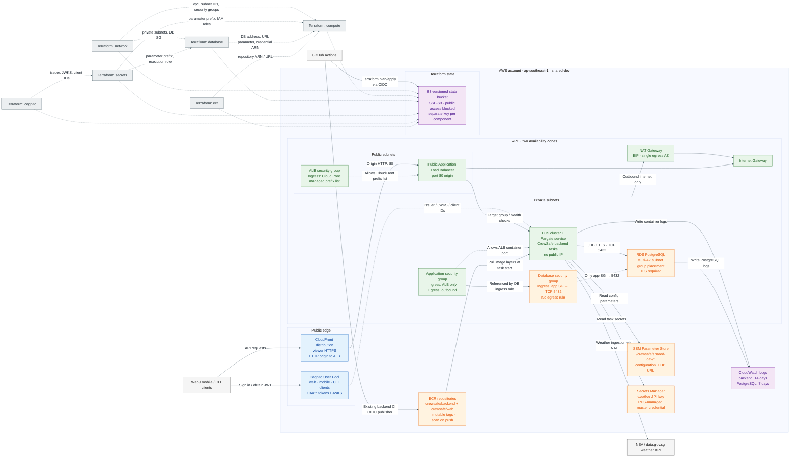

# Terraform Architecture

This diagram is derived from the Terraform roots under `infra/terraform/` and
describes the architecture declared for the shared development
environment. It is an infrastructure view, not a live AWS inventory; the
compute component deliberately lets CI own the running ECS task-definition
revision.

PlantUML source: [`terraform-architecture.puml`](terraform-architecture.puml)

## Architecture notes

- The ALB is public but only accepts origin traffic from CloudFront's AWS-managed
  prefix list; the backend remains in private subnets with no public IP.
- The single NAT gateway provides outbound access for private workloads. The
  database security group has the only database ingress rule and declares no
  egress rule.
- ECS task execution and task roles are separate. Execution reads image layers,
  logs, parameters, and secret references; the running application receives only
  its application secret reads.
- Cognito is provisioned separately and its issuer/JWKS/client identifiers flow
  into the secrets component through remote state before being consumed by ECS.
- Terraform state is account-isolated in one versioned S3 bucket, with an
  independent state key for each component. No DynamoDB lock table is declared.
- The shared ECR boundary contains the existing backend repository and the web repository
  provisioned by SCRUM-253. The GitHub Actions edge represents the existing backend publisher;
  the future web publisher is intentionally not represented until its follow-up workflow exists.
- `web/`, `mobile/`, ML, and agent runtimes are otherwise not represented because their
  Terraform roots do not yet exist.
