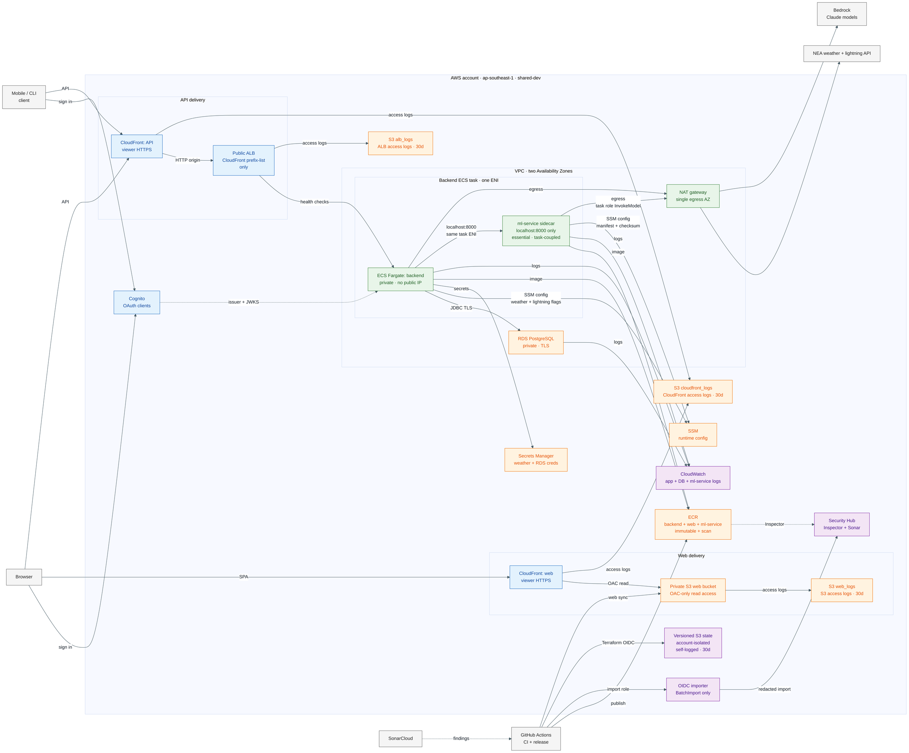
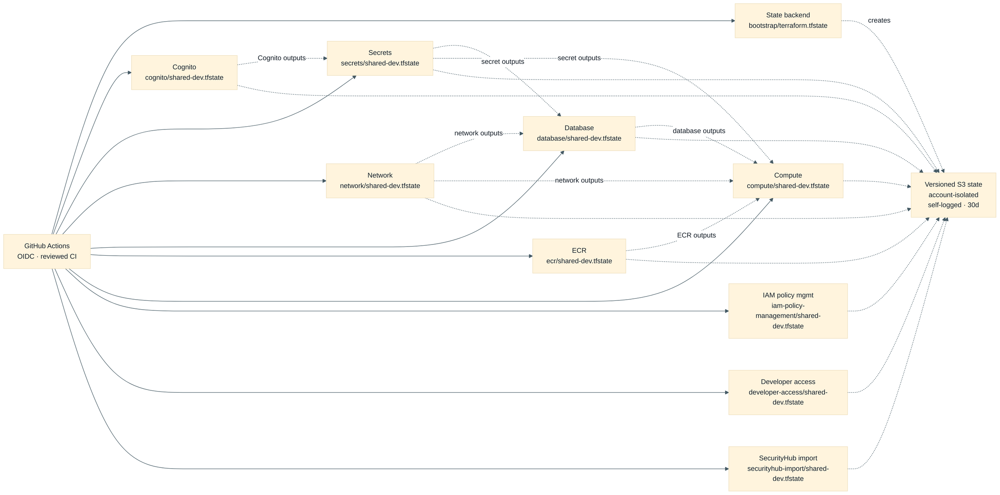
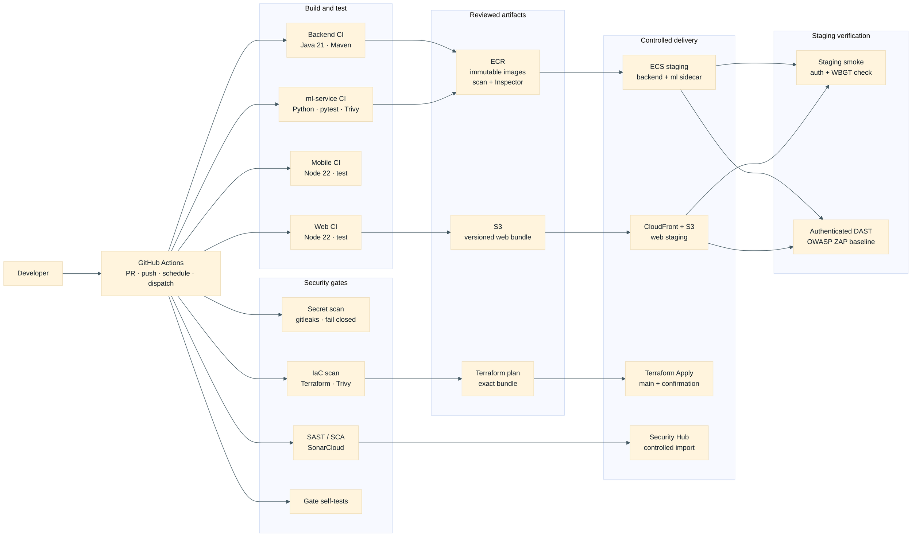

# Terraform Architecture

This is the infrastructure architecture **declared in this repository**, derived
from the Terraform component catalogue and roots under `infra/terraform/`. It is
not a live AWS inventory: a merged Terraform change is not deployed until its
reviewed CI plan and apply complete. Terraform runs in CI only.

PlantUML source: [`terraform-architecture.puml`](terraform-architecture.puml)

DevSecOps toolchain source: [`devsecops-toolchain.puml`](devsecops-toolchain.puml)

## Runtime boundaries

- The web SPA and backend API have **separate CloudFront distributions and
  hostnames**. The web distribution reads a private, versioned S3 bucket through
  Origin Access Control; it has no ECS, ALB, or VPC dependency. The web bucket
  delivers its own S3 server access logs to a dedicated, private, encrypted
  `web_logs` bucket (30-day lifecycle expiry) behind a least-privilege delivery
  policy scoped to the web bucket's own ARN (SonarQube `terraform:S6258`). Both
  CloudFront distributions write access logs to the shared, private,
  encrypted `cloudfront_logs` bucket with `backend/` and `web/` prefixes.
- The public ALB writes access logs to its dedicated, private, encrypted
  `alb_logs` bucket. The web, CloudFront, ALB, and Terraform state log targets
  use 30-day retention; the S3 log buckets self-log into bounded prefixes so
  the logging controls are themselves observable.
- API traffic is CloudFront → public ALB → private ECS task. The ALB accepts its
  origin traffic only from AWS's managed CloudFront prefix list. The temporary
  CloudFront-to-ALB origin transport is HTTP on port 80 because the AWS-owned ALB
  hostname has no project-controlled certificate; viewer traffic is redirected to
  HTTPS and application authentication/authorisation remains server-side.
- The backend task has no public IP. Its application security group is the sole
  allowed source to PostgreSQL on TCP 5432; the database security group declares
  no egress rule. A single NAT gateway provides private workload egress, including
  weather and lightning ingestion.
- ECS task execution and task roles are separate. Execution resolves image layers,
  logs, configuration and secret references; the running task role is restricted
  to the application reads it needs. Neither Terraform outputs nor this diagram
  expose credential values.
- `ml-service` runs as a **second container inside the same backend ECS task**, not
  a standalone service: Fargate `awsvpc` mode gives both containers one ENI, so
  `backend` reaches it over `localhost:8000` with no ALB target group, listener,
  service-discovery entry, or security-group ingress of its own — it is
  unreachable from outside the task. It is `essential: true`, so its failure stops
  the whole task, and it shares the backend task role, including a narrowly scoped
  `bedrock:InvokeModel` grant (exactly the Claude model identifiers `ml-service`
  and `backend` invoke — never `bedrock:*`, never a resource wildcard). The
  `WBGT_MODEL_MANIFEST`/`WBGT_MODEL_MANIFEST_SHA256` SSM parameters point at the
  checksum-verified `staging-demo-v1` bundle baked into the
  `ml-service` image (SCRUM-114/SCRUM-373) — activated for the shared staging
  demonstration only, not a production model approval; a manifest/checksum
  mismatch still fails safely to the persistence baseline.
- ECR provides immutable, scan-on-push backend, web, and ml-service repositories,
  each with its own scoped push role, plus continuous enhanced scanning through
  Inspector. The deployed web app is a static S3 sync, not an ECR runtime
  consumer. Terraform deliberately ignores the ECS service's task-definition
  revision and desired count: the reviewed release workflows are authoritative
  for the running backend and ml-service sidecar revisions.
- Compute also provisions separate, main-branch OIDC roles for web sync,
  backend deployment, ml-service sidecar deployment, and Cognito mapping
  publication. These roles are distinct from Terraform plan/apply roles; the
  ml-service deployment role updates the same shared ECS service but only from
  the explicit ml-service redeploy workflow.
- Security Hub receives Inspector ECR findings. The separately provisioned,
  main-branch GitHub OIDC role can import narrowly redacted eligible SonarCloud
  findings; it has no remediation or ticket-creation permission.

## Terraform component contracts

The [component catalogue](../../.github/terraform/components.json) is the
authoritative inventory of deployable roots. All managed components use a distinct
key in the account-isolated S3 state bucket. The `state-backend` component is the
exception: it self-bootstraps before using its own remote key. The state bucket is
versioned, protected from public access and self-logs its `access-logs/` prefix
with a 30-day lifecycle.

`iam-policy-management-shared-dev` is intentionally not shown as a remote-state
consumer: it centrally creates and attaches reviewed Terraform plan/apply policies
to the pre-existing GitHub OIDC roles. It includes separate `compute-s3-plan` and
`compute-s3-apply` bindings for the web and access-log buckets: plan is read-only,
while apply is limited to the reviewed bucket-management actions. `securityhub-import-
shared-dev` independently creates the narrow SonarCloud-to-Security-Hub importer role.
`developer-access-shared-dev` independently creates the read-only
`crewsafe-developers` IAM group (AWS-managed `ViewOnlyAccess`) and its member
users. None of the three creates a runtime application dependency or consumes
another component's outputs.

## DevSecOps toolchain

The repository implements the following CI/CD and security flow. Checks run on pull
requests and pushes where the workflow is scoped; promotion and infrastructure
mutation remain controlled main-branch workflows.

The detailed standalone PlantUML version is
[`devsecops-toolchain.puml`](devsecops-toolchain.puml); it includes the CI lanes,
OIDC roles, artifact flow, plan/apply controls and evidence paths.

Backend and web promotion uses immutable, commit-addressed artifacts. Their main-branch
push paths publish/deploy automatically after build and test; `backend-ci.yml` also
supports a manual main-only redeploy of an existing backend image, while `web-sync.yml`
remains a manual exact-commit recovery path. `ml-service-ci.yml` verifies and publishes
the sidecar image on main, but a sidecar image is deployed only through an explicit
`workflow_dispatch` redeploy of an existing main-ancestor SHA using the dedicated
ml-service deployment role. Terraform mutation is CI-only and requires the exact
reviewed plan, commit, account and typed confirmation; a Terraform apply registers a
task-definition revision but does not itself own the running ECS revision.

Security scanning fails closed for unavailable secret scanning. SonarCloud coverage
is generated for backend, web, mobile, and ml-service before analysis; the ML-service
publish-time Trivy report is currently evidence-only while ECR enhanced scanning and
Inspector provide the registry-side control. The SonarCloud-to-Security-Hub path is a
main-branch, controlled, redacted import with no remediation or ticket-creation
permission. Workflow supply-chain controls disable package lifecycle scripts
(`npm ci --ignore-scripts`, with offline Expo prebuild), require HTTPS for downloaded
tools, and verify the pinned scanner/CLI archives by checksum. After a successful
backend or web staging deploy, the corresponding
release workflow calls a shared staging-smoke check (synthetic sign-in plus a WBGT
read/forecast round trip) and an authenticated DAST scan (ZAP baseline against the
deployed staging origins); both run as post-deploy evidence and do not roll back or
gate the release that already happened.

## Manual operational workflows

The following further workflow families exist outside the push/PR pipeline above: they are
`workflow_dispatch`-only, gated to `github.ref == 'refs/heads/main'`, and never
triggered by a push or a pull request.

- **Web recovery/sync** (`web-sync.yml`, SCRUM-271): accepts an exact 40-character
  main-branch commit SHA, reruns the web audit/lint/type/test/build gates, assumes
  the dedicated web-sync OIDC role, verifies the edge contract, syncs the versioned
  S3 bucket with deletion of stale objects, and requests a CloudFront invalidation.

- **Mobile security testing** (`mobile-native-build.yml` → `mobsf-dynamic-scan.yml`,
  SCRUM-348/SCRUM-350): builds a non-store Android/iOS artifact for internal security
  testing and QA only — a structural test fails the build if a Play Store/App
  Store/TestFlight step is ever added — then, given a build produced with
  `auth_mode=cognito-password`, drives MobSF dynamic analysis with a Maestro-scripted
  sign-in/API-call/sign-out flow against the real staging backend. Findings are
  recorded as CI evidence and are non-blocking this iteration.
- **Cognito operations** (`cognito-mapping-publication.yml`,
  `cognito-user-administration.yml`): publish the staging Cognito app-client mapping
  and perform an allowlisted set of user/group administration operations (inspect,
  list, enable/disable, password reset, forced global sign-out, group membership,
  synthetic-worker lifecycle). Every state-changing call requires a typed
  `<operation> <alias> <subject>` confirmation phrase, mirroring the Terraform Apply
  gate's confirmation pattern.

The detailed standalone PlantUML page for these manual flows is the third page of
[`devsecops-toolchain.puml`](devsecops-toolchain.puml).

## Declared component inventory

| Component | Responsibility | Upstream Terraform state |
| --- | --- | --- |
| `state-backend` | Account-isolated, versioned, protected and self-logged state bucket | Self-bootstrap |
| `cognito-shared-dev` | Shared user pool, OAuth clients, groups and administration role | — |
| `network-shared-dev` | VPC, two-AZ public/private subnets, NAT, app and database security groups | — |
| `secrets-shared-dev` | Runtime configuration (incl. `ml-service` model-manifest SSM parameters), weather-secret container and ECS roles | Cognito |
| `database-shared-dev` | PostgreSQL, subnet/parameter groups, logs and connection configuration | Network, secrets |
| `ecr-shared-dev` | Backend/web/ml-service repositories, each with a scoped push role, scan-on-push and continuous Inspector scanning, plus a Security Hub insight | — |
| `compute-shared-dev` | Backend ECS/ALB/API edge (with the ml-service sidecar container, SCRUM-373), static web S3/CloudFront delivery, and ALB/CloudFront/S3 access-log targets | Network, secrets, database, ECR |
| `iam-policy-management-shared-dev` | Centrally managed least-privilege Terraform CI policies and attachments | — |
| `developer-access-shared-dev` | Individual read-only developer IAM console/CLI users and group policy | — |
| `securityhub-import-shared-dev` | OIDC role restricted to controlled SonarCloud finding imports | — |

## Deliberate limitations and follow-ups

- `ml-service` is declared and deployed (SCRUM-373) as a same-task ECS sidecar —
  it is no longer an undeclared, product-plan-only target. What remains
  deliberately undeclared: a separate ML/agent ECS service, mobile deployment
  runtime, EventBridge scheduling, or production custom domains/certificates.
  The current sidecar release is CI-controlled and the application schedulers
  are inside the backend task; these remain product-plan targets, not current
  Terraform resources.
- `ml-service`'s trained-model activation is now live for a time-limited,
  explicitly non-production exception: `WBGT_MODEL_MANIFEST`/
  `WBGT_MODEL_MANIFEST_SHA256` point at the checksum-pinned `staging-demo-v1`
  bundle baked into the `ml-service` image (SCRUM-114/SCRUM-373, accepted by
  decision owner Bryan Phang on 16 August 2026 as a university-project staging
  demonstration only — `ml-service/MODEL_CARD.md`). It does not satisfy the
  normal 21-day post-freeze production-evidence procedure, does not alter the
  deterministic policy or human-approval boundaries, and a manifest/checksum
  mismatch still fails safely to the persistence baseline — see
  `docs/runbooks/SCRUM-373-ml-service-deploy.md` §8.0 for the exception and
  §8 generally for the value-only parameter-plus-redeploy activation path (no
  task-definition or Terraform-shape change).
- A model bundle shipped via S3 rather than baked into the `ml-service` image is
  explicitly out of scope for this architecture; no S3 read permission exists on
  either ECS identity for that purpose. The one trained candidate that exists
  today sits in a SageMaker Studio experiment output in **a separate AWS
  account** (`087819194272`, `ap-southeast-2`) — not the account this
  architecture's `secrets`/`compute`/`ecr` deploy to (`ap-southeast-1` only;
  `secrets/variables.tf` rejects any other region), and not one this diagram
  connects to, since no cross-account IAM trust or Terraform dependency exists
  between them. Promoting that candidate is a manual, out-of-band pull
  performed on a developer's own workstation, never a live or CI-driven
  fetch — see `docs/runbooks/SCRUM-373-ml-service-deploy.md` §8.1 for its
  exact bucket/prefix inventory and §8.2 for the promotion steps.
- Both CloudFront distributions use provider-issued hostnames. Their declared
  default-certificate setting therefore has a TLS 1.0 minimum; raising that floor
  requires a project-controlled domain, ACM certificate in `us-east-1`, and DNS
  work as a separately reviewed change.
- The diagram intentionally does not represent Terraform state as a source of
  truth for the running ECS revision, credentials, live configuration values, or
  AWS inventory. In particular, the backend and ml-service workflows can update
  the shared ECS service after Terraform registers a task-definition revision.
  Consult the reviewed deployment workflows and AWS service observations for
  operational state.
