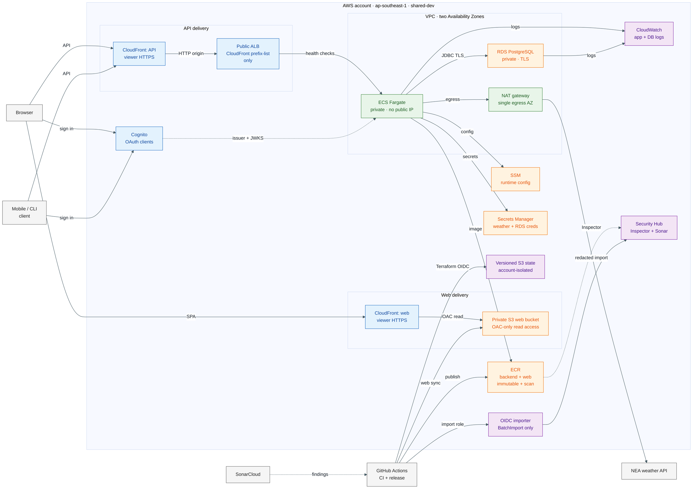
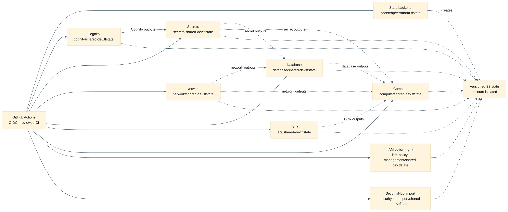
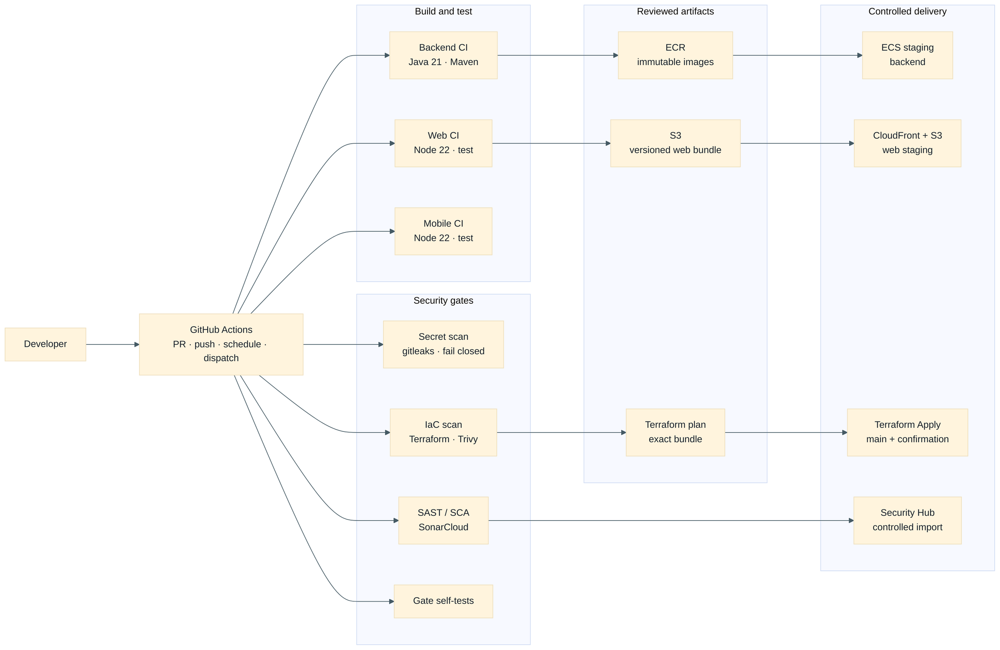

# Terraform Architecture

This is the infrastructure architecture **declared in this repository**, derived
from the Terraform component catalogue and roots under `infra/terraform/`. It is
not a live AWS inventory: a merged Terraform change is not deployed until its
reviewed CI plan and apply complete. Terraform runs in CI only.

PlantUML source: [`terraform-architecture.puml`](terraform-architecture.puml)

DevSecOps toolchain source: [`devsecops-toolchain.puml`](devsecops-toolchain.puml)

## Runtime boundaries

- The web SPA and backend API have **separate CloudFront distributions and
  hostnames**. The web distribution reads a private, versioned S3 bucket through
  Origin Access Control; it has no ECS, ALB, or VPC dependency.
- API traffic is CloudFront → public ALB → private ECS task. The ALB accepts its
  origin traffic only from AWS's managed CloudFront prefix list. The temporary
  CloudFront-to-ALB origin transport is HTTP on port 80 because the AWS-owned ALB
  hostname has no project-controlled certificate; viewer traffic is redirected to
  HTTPS and application authentication/authorisation remains server-side.
- The backend task has no public IP. Its application security group is the sole
  allowed source to PostgreSQL on TCP 5432; the database security group declares
  no egress rule. A single NAT gateway provides private workload egress, including
  weather ingestion.
- ECS task execution and task roles are separate. Execution resolves image layers,
  logs, configuration and secret references; the running task role is restricted
  to the application reads it needs. Neither Terraform outputs nor this diagram
  expose credential values.
- ECR provides immutable, scan-on-push backend and web repositories. The deployed
  web app is a static S3 sync, not an ECR runtime consumer. Terraform deliberately
  ignores the ECS service's task-definition revision and desired count: the
  reviewed release workflow is authoritative for the running backend revision.
- Security Hub receives Inspector ECR findings. The separately provisioned,
  main-branch GitHub OIDC role can import narrowly redacted eligible SonarCloud
  findings; it has no remediation or ticket-creation permission.

## Terraform component contracts

The [component catalogue](../../.github/terraform/components.json) is the
authoritative inventory of deployable roots. All managed components use a distinct
key in the account-isolated S3 state bucket. The `state-backend` component is the
exception: it self-bootstraps before using its own remote key.

`iam-policy-management-shared-dev` is intentionally not shown as a remote-state
consumer: it centrally creates and attaches reviewed Terraform plan/apply policies
to the pre-existing GitHub OIDC roles. `securityhub-import-shared-dev` independently
creates the narrow SonarCloud-to-Security-Hub importer role. Neither component
creates a runtime application dependency.

## DevSecOps toolchain

The repository implements the following CI/CD and security flow. Checks run on pull
requests and pushes where the workflow is scoped; promotion and infrastructure
mutation remain controlled main-branch workflows.

The detailed standalone PlantUML version is
[`devsecops-toolchain.puml`](devsecops-toolchain.puml); it includes the CI lanes,
OIDC roles, artifact flow, plan/apply controls and evidence paths.

Backend and web promotion uses immutable, commit-addressed artifacts. Terraform
mutation is CI-only and requires the exact reviewed plan, commit, account and typed
confirmation. Security scanning fails closed for unavailable secret scanning; the
SonarCloud analysis covers backend, web and mobile, with coverage generated before
analysis. The SonarCloud-to-Security-Hub path is a controlled, redacted import with no
remediation or ticket-creation permission.

## Declared component inventory

| Component | Responsibility | Upstream Terraform state |
| --- | --- | --- |
| `state-backend` | Account-isolated, versioned and protected state bucket | Self-bootstrap |
| `cognito-shared-dev` | Shared user pool, OAuth clients, groups and administration role | — |
| `network-shared-dev` | VPC, two-AZ public/private subnets, NAT, app and database security groups | — |
| `secrets-shared-dev` | Runtime configuration, weather-secret container and ECS roles | Cognito |
| `database-shared-dev` | PostgreSQL, subnet/parameter groups, logs and connection configuration | Network, secrets |
| `ecr-shared-dev` | Backend/web repositories, Inspector scanning and Security Hub insight | — |
| `compute-shared-dev` | Backend ECS/ALB/API edge and static web S3/CloudFront delivery | Network, secrets, database, ECR |
| `iam-policy-management-shared-dev` | Centrally managed least-privilege Terraform CI policies and attachments | — |
| `developer-access-shared-dev` | Individual read-only developer IAM console/CLI users and group policy | — |
| `securityhub-import-shared-dev` | OIDC role restricted to controlled SonarCloud finding imports | — |

## Deliberate limitations and follow-ups

- This shared-development architecture does not declare the planned internal ML
  service, agent runtime, mobile deployment runtime, EventBridge scheduling, or
  production custom domains/certificates. They remain product-plan targets, not
  current Terraform resources.
- Both CloudFront distributions use provider-issued hostnames. Their declared
  default-certificate setting therefore has a TLS 1.0 minimum; raising that floor
  requires a project-controlled domain, ACM certificate in `us-east-1`, and DNS
  work as a separately reviewed change.
- The diagram intentionally does not represent Terraform state as a source of
  truth for the running ECS revision, credentials, live configuration values, or
  AWS inventory. Consult the reviewed deployment workflows and AWS service
  observations for operational state.
