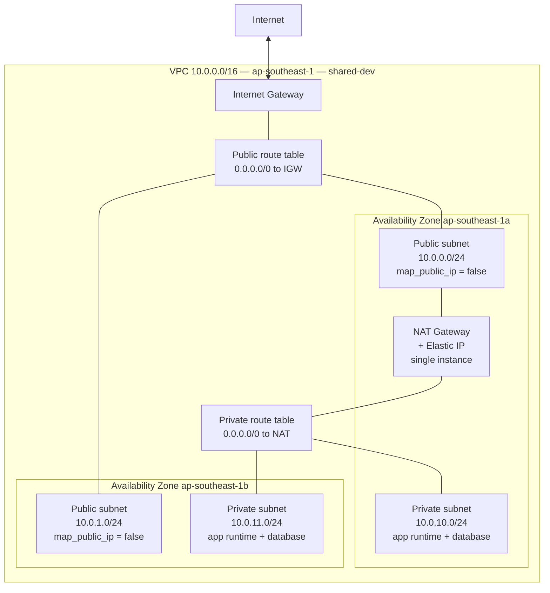
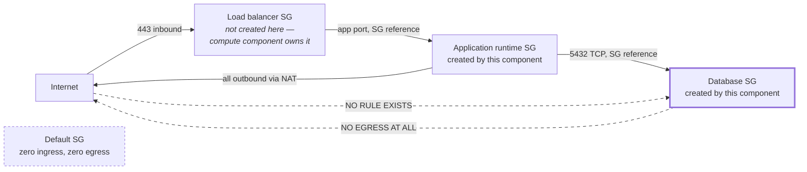
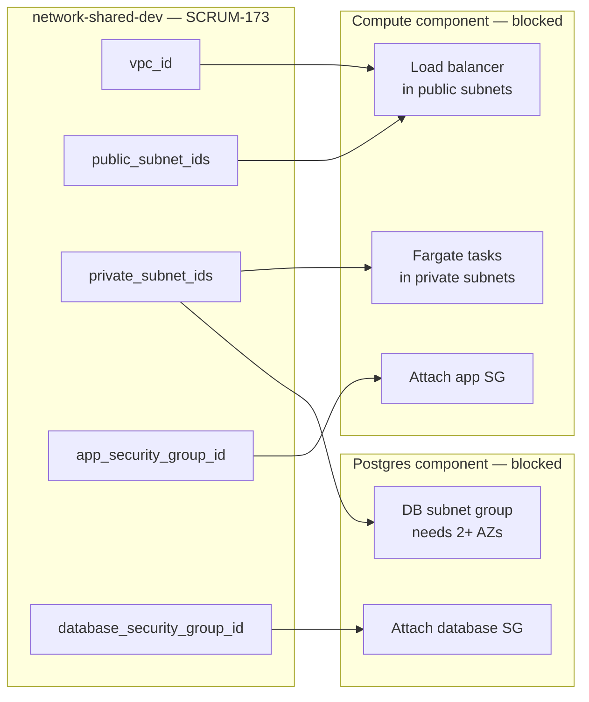

# SCRUM-173 — Network Baseline: VPC, Subnets, Security Groups

## Summary

Provision the shared staging network for CrewSafe in `ap-southeast-1` as the third
Terraform component, `network-shared-dev`. It is an infrastructure **producer**: it creates
no database and no compute, and exists to publish a network and an access-control boundary
that the Postgres instance and the backend compute runtime attach to.

Waits on SCRUM-155 (remote state, Done). Blocks the Postgres instance and the backend
compute runtime.

The implementation is incomplete until
[`docs/runbooks/SCRUM-173-network-baseline.md`](../runbooks/SCRUM-173-network-baseline.md)
has been followed to attach the IAM policies and run the first plan.

## Scope decisions

Four decisions shaped this component. Each was taken deliberately and each has a cost worth
knowing about later.

### 1. One shared network, not one per teammate

The network follows the identity component's shared model (`cognito-shared-dev`), not the
per-teammate model the state backend uses. One network serves the team, so the database and
compute components built on it are likewise shared.

**Cost**: the network is shared infrastructure — a careless change affects everyone. Mitigated
by `allow_destroy: false` in the catalogue and by the account precondition described below.

### 2. Two subnet tiers, not three

Public and private only. The database shares the private tier with the application runtime
rather than occupying an isolated no-egress tier.

**Cost, and this is the important one**: routing provides no second barrier. The database's
protection against the internet rests **entirely** on its security group. There is no
defence in depth on the inbound path. This is why the negative test described below is
mandatory rather than nice-to-have — it is the only thing standing between the database and
the internet, and it must be demonstrated catching a widened rule, not merely passing.

The outbound half of that trade was closed for free: the database security group is declared
with no egress rule at all, so sharing the private tier hands it no outbound path.

### 3. One NAT gateway, not one per zone

Private egress runs through a single NAT gateway in `ap-southeast-1a`, roughly halving the
recurring cost (~USD 32/month rather than ~64).

**Cost**: egress is not zone-redundant. Losing `ap-southeast-1a` removes outbound internet
access for the entire private tier until the gateway is recreated, even though the subnets in
`ap-southeast-1b` survive and inbound service through a load balancer is unaffected. Making
egress zone-redundant means one gateway per zone and is a separately funded change.

### 4. NAT gateway, not service-specific VPC endpoints

Unrestricted outbound reach, which the backend needs for the external weather API as well as
for container images, with nothing to allowlist as services are added.

**Cost**: recurring spend, and less restrictive than an endpoint-only posture. Endpoints
remain available as a later tightening.

## Architecture

### Network topology



No route carries traffic from the internet gateway into a private subnet. Outbound requests
from the private tier leave through the NAT gateway and their replies return on that
established connection; that is not an inbound route.

### Security group trust boundary



| Rule | Source / destination | Port |
| --- | --- | --- |
| Database ingress | Application runtime SG, **by group id** — never a CIDR | 5432 TCP only |
| Database ingress from internet | **None. No rule exists.** | — |
| Database egress | **None. No egress rule at all.** | — |
| Application runtime egress | Unrestricted, out through the NAT gateway | all |
| Any administrative access | **None** — no 22, no 3389, from any source | — |
| Default security group | All rules stripped, ingress and egress | — |

This component creates no load balancer security group and opens no inbound path to the
application tier; both belong to the compute component.

### Producer contract



Output names and list ordering are contractual. Both subnet lists are ordered to follow
`var.availability_zones`, so index 0 of each is the same availability zone and a consumer can
pair a load balancer with its tasks by index without re-deriving zones.

Consumers bind through remote state:

```hcl
data "terraform_remote_state" "network" {
  backend = "s3"
  config = {
    bucket = "crewsafe-terraform-state-<account-id>-ap-southeast-1"
    key    = "crewsafe/network/shared-dev.tfstate"
    region = "ap-southeast-1"
  }
}
```

## Two obligations this component cannot enforce

Both belong in the acceptance criteria of the issues that consume this network.

1. **The Postgres component must set `publicly_accessible = false`.** A publicly accessible
   RDS instance placed in a private subnet still receives a public endpoint, and no security
   group rule here prevents that setting.
2. **The database must listen on 5432.** The ingress rule admits only that port, so a
   different port yields a silently unreachable database.

## Component registration

```json
"network-shared-dev": {
  "jira_key": "SCRUM-173",
  "root": "infra/terraform/network",
  "backend_strategy": "remote",
  "state_key": "crewsafe/network/shared-dev.tfstate",
  "allow_destroy": false
}
```

`allow_destroy: false` is load-bearing: the resolver refuses a destroy dispatch, so the
network underneath the database and compute components cannot be torn out by a mistaken run.

**No workflow file was added or edited.** `terraform-validate.yml` builds its job matrix from
the catalogue keys, so registering the component is what starts `fmt`, `validate`, and
`terraform test` running against it. This is the extensibility SCRUM-154 designed for,
working as intended.

### One existing guard test required updating

`test-component-catalog.sh` pinned the catalogue to an exact two-key set
(`["cognito-shared-dev","state-backend"]`), so **any** third component fails it by
construction. The assertion was extended to the three-key set and given the same
state-key and destroy-approval coverage for the new component that the existing ones have.

This is an inventory assertion tracking reality, not a loosened test — the guard still pins
the exact component set, and it now also pins `allow_destroy: false` for the network. Worth
knowing for the next component: it will need the same one-line update.

## Design constraints

Written under roughly three weeks of sprint capacity shared with the dependent issues.

- **Flat, literal HCL.** No reusable child module, no wrapper, no third-party module. One
  directory a reviewer can read top to bottom. Extracting a module is a decision for when a
  second network exists.
- **19 resources** across 15 declarations, under the ~20 budget.
- **Two availability zones**, the minimum a managed PostgreSQL subnet group accepts.
- **Address plan**: `cidrsubnet` indices 0–1 for public and 10–11 for private, leaving 2–9
  and 12+ free so either tier can grow without renumbering the other.
- **Copied from `infra/terraform/cognito`**: variable validation, version pinning, tagging,
  the caller-identity precondition, the two IAM policy documents, and the mocked-provider
  test harness. Adaptation rather than design.

### Deferred, not dropped

Network flow logs, NACL hardening, WAF, service-specific VPC endpoints, per-zone egress
redundancy, cross-account connectivity, and any reusable module extraction.

## Testing

Thirteen `terraform test` run blocks against a mocked provider — no AWS account, credential,
or network call. Nine reject malformed input, one asserts the topology, one proves the account
precondition bites, one covers the database boundary, one covers the producer contract.

### The negative test is the point

Under Constitution Principle II, security-sensitive behaviour needs negative tests. Because
the two-tier decision leaves the security group as the sole boundary, that test was
demonstrated **failing against a deliberately widened rule** before being trusted:

```
aws_vpc_security_group_ingress_rule.database_from_app.cidr_ipv4 is "0.0.0.0/0"
→ Database ingress must never use a CIDR source, and never 0.0.0.0/0 or ::/0 (FR-011)
```

Only then was the rule narrowed to `referenced_security_group_id`. A test that would pass
against a widened rule is the failure mode this guards against; observing it fail because
resources did not yet exist proves only that the test runs, not that it discriminates.

### Two things the mocked tests structurally cannot prove

Both are verified by reading the real plan output, and both are review obligations recorded
in the runbook:

1. **The database security group has no egress.** AWS attaches an allow-all egress rule to
   every security group at creation; Terraform revokes it only because `aws_security_group` is
   declared with no inline `egress` block. A mocked plan never sees AWS's implicit rule, so
   the test proves only that *we* declare none.
2. **The default security group has no rules.** Its rule sets are computed attributes and are
   unknown at plan time. The test asserts the resource is adopted against our VPC — which is
   what causes the revocation — but the zero-rule outcome itself is only visible in the plan.

## Constitution compliance

| Principle | Status |
| --- | --- |
| I — Maintainable Code Quality | Flat HCL, every input validated at the boundary, no abstraction, within the approved stack so no ADR needed |
| II — Secure by Design | Deny-by-default at the object boundary; account precondition; least-privilege plan/apply policies; no secrets or account identifiers committed; negative test demonstrated failing first |
| III — Test-First Evidence | Tests authored and observed failing before every production file; deterministic via mocked provider and a pinned AZ list |
| IV — Consistent and Accessible UX | **N/A by subject matter** — no web, mobile, or worker-facing surface. The only human surface is the CI operator's workflow run, whose refusals are textual, never colour-coded |
| V — Measured Performance and Reliability | Endpoint latency targets N/A (no endpoint); zone-loss behaviour, 15-minute provisioning, and idempotency defined; the single-AZ egress limitation stated rather than hidden |
| Engineering and Safety Constraints | Within plan §10.3; no probabilistic component; reproducible IaC reviewed before apply; remote state with locking; destruction safeguarded |
